# Design Document: Battery Passport Platform

## Overview

This design document specifies the technical architecture for converting the Digital Battery Passport & Lifecycle Data Platform prototype into a maintainable React + TypeScript + Vite application. The platform demonstrates an EU Battery Passport for Rimac Energy SineStack BESS assets, combining compliance tracking, BMS telemetry visualization, lifecycle traceability, and ESG reporting in a premium B2B energy-tech interface.

The application is a client-side SPA using local mock data exclusively. It targets board-level strategic partnership demonstrations between Ericsson Nikola Tesla and Rimac Energy. All data is synthetic, clearly marked as demo, and the UI must communicate this through persistent "Demo Mode" indicators.

The architecture prioritizes: reusable component composition, strict TypeScript type safety, role-based view filtering, and a polished visual language that avoids generic admin dashboard patterns.

## Architecture

### System Architecture

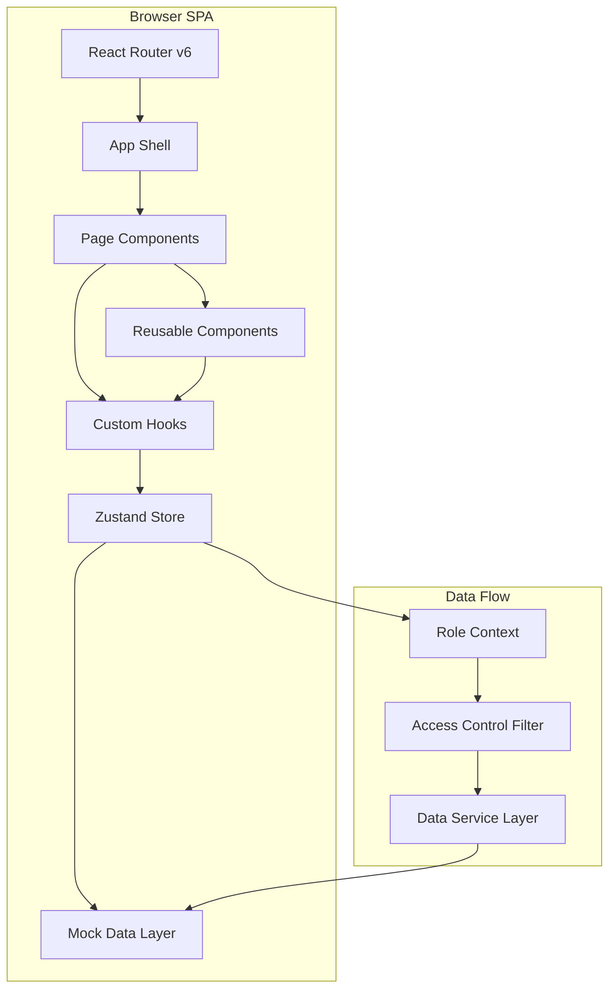

### Application Shell Architecture

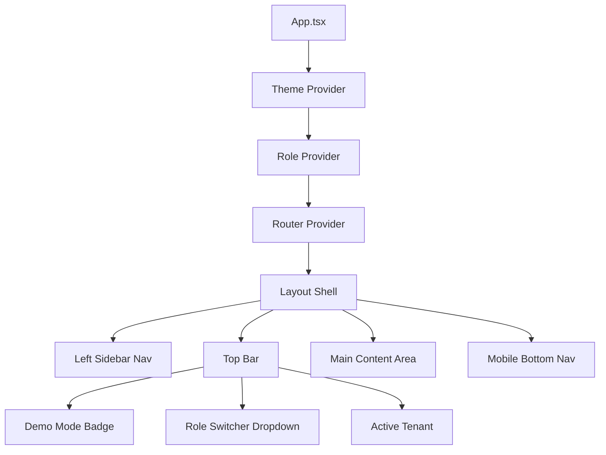

### State Management

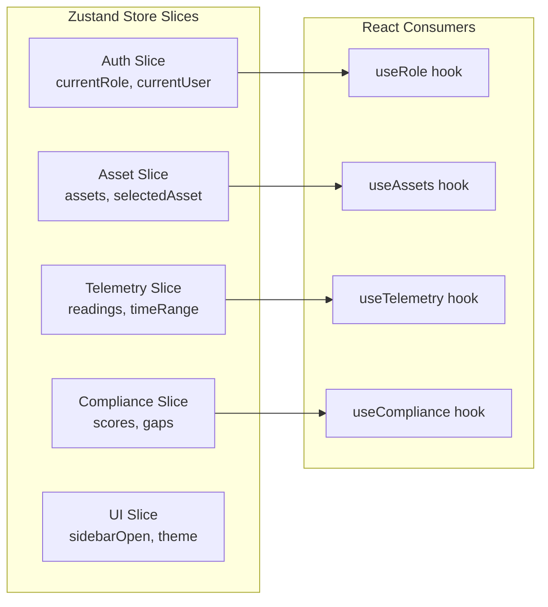

## Sequence Diagrams

### Role-Based Page Load

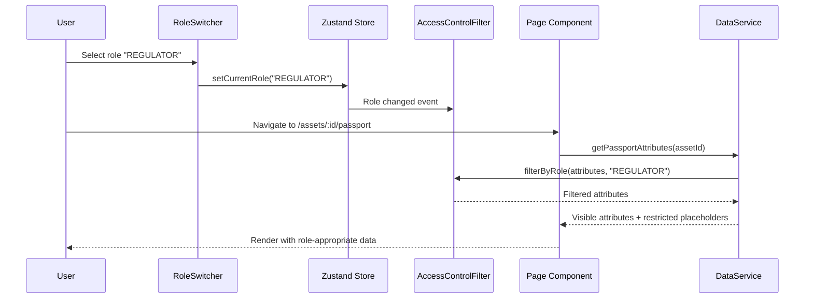

### Telemetry Dashboard Load

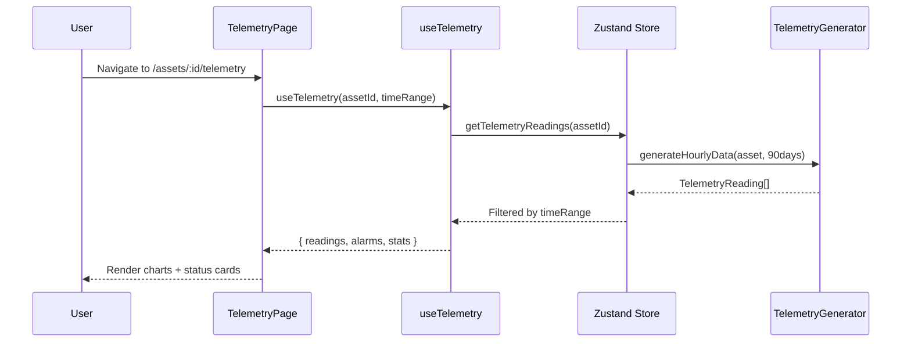

## Routes Mapping

Based on Section 14 of requirements:

| Route | Page Component | Auth Required | Roles Allowed |
|-------|---------------|---------------|---------------|
| `/` | `LandingPage` | No | All |
| `/public/passport/:passportId` | `PublicPassportPage` | No | All (PUBLIC_VIEWER) |
| `/login` | `LoginPage` | No | All |
| `/dashboard` | `DashboardPage` | Yes | All authenticated |
| `/assets` | `AssetRegistryPage` | Yes | All authenticated |
| `/assets/:assetId` | `AssetDetailPage` | Yes | All authenticated |
| `/assets/:assetId/passport` | `PassportDetailPage` | Yes | ASSET_OWNER, RIMAC_SERVICE_ENGINEER, ENT_PLATFORM_OPERATOR, REGULATOR, RECYCLER, ADMIN |
| `/assets/:assetId/telemetry` | `TelemetryPage` | Yes | ASSET_OWNER, RIMAC_SERVICE_ENGINEER, ENT_PLATFORM_OPERATOR, ADMIN |
| `/assets/:assetId/timeline` | `LifecycleTimelinePage` | Yes | All authenticated |
| `/compliance` | `CompliancePage` | Yes | ASSET_OWNER, RIMAC_SERVICE_ENGINEER, ENT_PLATFORM_OPERATOR, REGULATOR, ADMIN |
| `/documents` | `DocumentVaultPage` | Yes | All authenticated |
| `/audit` | `AuditTrailPage` | Yes | ENT_PLATFORM_OPERATOR, REGULATOR, ADMIN |
| `/tasks` | `TasksPage` | Yes | ASSET_OWNER, RIMAC_SERVICE_ENGINEER, ENT_PLATFORM_OPERATOR, ADMIN |
| `/system` | `SystemStatusPage` | Yes | ENT_PLATFORM_OPERATOR, ADMIN |
| `/admin/demo-data` | `DemoDataAdminPage` | Yes | ADMIN |

## Components and Interfaces

### Component Hierarchy

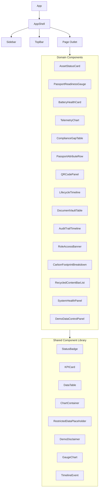

### Component 1: AppShell

**Purpose**: Root layout component providing persistent navigation, top bar, role context, and responsive behavior.

**Interface**:
```typescript
interface AppShellProps {
  children: React.ReactNode;
}

// Internal state managed via Zustand
interface UIState {
  sidebarOpen: boolean;
  sidebarCollapsed: boolean;
  mobileNavOpen: boolean;
  toggleSidebar: () => void;
  collapseSidebar: () => void;
  toggleMobileNav: () => void;
}
```

**Responsibilities**:
- Render left sidebar with navigation links
- Render top bar with demo badge, role switcher, tenant info
- Handle responsive breakpoints (desktop sidebar, tablet collapsed, mobile bottom nav)
- Provide breadcrumb context to child pages

### Component 2: RoleSwitcher

**Purpose**: Demo-mode dropdown that allows switching the active user role to demonstrate RBAC behavior.

**Interface**:
```typescript
interface RoleSwitcherProps {
  className?: string;
}

// Uses useRole hook internally
interface RoleState {
  currentRole: UserRole;
  currentUser: DemoUser;
  setRole: (role: UserRole) => void;
  permissions: Permission[];
}
```

**Responsibilities**:
- Display current role with avatar and label
- Dropdown with all 7 demo roles
- On role change, update global state causing all components to re-filter data
- Show brief description of what each role can see

### Component 3: AssetStatusCard

**Purpose**: Summary card for a single BESS asset showing key health, compliance, and connectivity indicators.

**Interface**:
```typescript
interface AssetStatusCardProps {
  asset: Asset;
  variant?: 'compact' | 'expanded';
  onClick?: (assetId: string) => void;
  className?: string;
}
```

**Responsibilities**:
- Display asset name, location, owner
- Show SoC/SoH gauges with color coding
- Display compliance score badge (Critical/Needs Attention/Nearly Ready/Ready)
- Show connectivity status indicator
- Show alarm status with appropriate color (amber for warning, red for critical)
- Glassmorphism card style for expanded variant on dashboard

### Component 4: PassportReadinessGauge

**Purpose**: Circular or semi-circular gauge showing passport completion percentage with color-coded segments.

**Interface**:
```typescript
interface PassportReadinessGaugeProps {
  score: number; // 0-100
  label?: string;
  size?: 'sm' | 'md' | 'lg';
  showSegments?: boolean; // Show Critical/Attention/Nearly Ready/Ready segments
  className?: string;
}
```

**Responsibilities**:
- Render animated gauge from 0-100%
- Color segments: 0-49 red, 50-74 amber, 75-89 cyan, 90-100 emerald
- Display numeric score prominently
- Optional segment labels
- Demo disclaimer tooltip

### Component 5: TelemetryChart

**Purpose**: Time-series chart for BMS telemetry data using Recharts, supporting multiple metrics.

**Interface**:
```typescript
interface TelemetryChartProps {
  data: TelemetryReading[];
  metric: TelemetryMetric;
  timeRange: TimeRange;
  onTimeRangeChange?: (range: TimeRange) => void;
  showAlarms?: boolean;
  height?: number;
  className?: string;
}

type TelemetryMetric = 
  | 'soc' 
  | 'soh' 
  | 'temperature' 
  | 'energy' 
  | 'efficiency' 
  | 'availability';

type TimeRange = '24h' | '7d' | '30d' | '90d';
```

**Responsibilities**:
- Render line/area charts with Recharts
- Support zoom and time range selection
- Overlay alarm events on chart timeline
- Responsive sizing
- Tooltip with precise values and timestamps
- Color-coded threshold lines (warning amber, critical red)

### Component 6: ComplianceGapTable

**Purpose**: Filterable table showing passport attribute completion status with gap highlighting.

**Interface**:
```typescript
interface ComplianceGapTableProps {
  attributes: PassportAttribute[];
  onFilterChange?: (filter: AttributeStatusFilter) => void;
  onCreateTask?: (attributeId: string) => void;
  showConfidence?: boolean;
  className?: string;
}

type AttributeStatusFilter = 
  | 'all' 
  | 'missing' 
  | 'draft' 
  | 'provided' 
  | 'verified' 
  | 'expired';
```

**Responsibilities**:
- Display attributes in grouped table by passport section
- Status badge per attribute (color + text)
- Confidence level indicator
- Source column showing data origin
- Filter controls
- "Create Task" action button for gaps
- Top 5 gaps summary panel

### Component 7: RestrictedDataPlaceholder

**Purpose**: Placeholder shown when a data section is not accessible to the current role.

**Interface**:
```typescript
interface RestrictedDataPlaceholderProps {
  section: string;
  requiredRoles: UserRole[];
  message?: string;
  className?: string;
}
```

**Responsibilities**:
- Display lock icon with section name
- Show which roles have access
- Provide contextual message explaining restriction
- Consistent styling across all restricted sections

### Component 8: LifecycleTimeline

**Purpose**: Vertical timeline displaying lifecycle events for an asset.

**Interface**:
```typescript
interface LifecycleTimelineProps {
  events: LifecycleEvent[];
  filterCategory?: EventCategory;
  className?: string;
}

type EventCategory = 
  | 'all' 
  | 'production' 
  | 'operational' 
  | 'service' 
  | 'compliance';
```

**Responsibilities**:
- Render vertical timeline with event nodes
- Color-code by event category
- Distinguish BMS-generated from manual events (different icon style)
- Show actor, timestamp, source, and linked document
- Filter by category
- Expandable event details

### Component 9: KPICard

**Purpose**: Reusable card displaying a single KPI metric with large number, label, trend, and optional sparkline.

**Interface**:
```typescript
interface KPICardProps {
  label: string;
  value: string | number;
  unit?: string;
  trend?: { direction: 'up' | 'down' | 'stable'; value: string };
  icon?: LucideIcon;
  variant?: 'default' | 'glass' | 'accent';
  accentColor?: 'cyan' | 'emerald' | 'amber' | 'red';
  className?: string;
}
```

**Responsibilities**:
- Large numeric display with tabular numbers
- Micro-label beneath value
- Optional trend indicator with arrow
- Optional icon from lucide-react
- Glass morphism variant for hero cards
- Accent color border/glow for emphasis

### Component 10: StatusBadge

**Purpose**: Consistent badge component for all status displays across the application.

**Interface**:
```typescript
interface StatusBadgeProps {
  status: AttributeStatus | ComplianceLevel | ConnectivityStatus | AlarmStatus;
  size?: 'xs' | 'sm' | 'md';
  showIcon?: boolean;
  className?: string;
}

type AttributeStatus = 'missing' | 'draft' | 'provided' | 'verified' | 'expired' | 'not_applicable';
type ComplianceLevel = 'critical_gaps' | 'needs_attention' | 'nearly_ready' | 'passport_ready';
type ConnectivityStatus = 'online' | 'offline' | 'pending';
type AlarmStatus = 'normal' | 'warning' | 'critical' | 'none';
```

**Responsibilities**:
- Render colored pill with text label
- Always include text — never rely on color alone
- Optional icon prefix
- Consistent color mapping across all uses

## Data Models

### Core TypeScript Types

```typescript
// ============================================================
// ROLES & ACCESS CONTROL
// ============================================================

type UserRole =
  | 'PUBLIC_VIEWER'
  | 'ASSET_OWNER'
  | 'RIMAC_SERVICE_ENGINEER'
  | 'ENT_PLATFORM_OPERATOR'
  | 'REGULATOR'
  | 'RECYCLER'
  | 'ADMIN';

interface DemoUser {
  id: string;
  name: string;
  email: string;
  role: UserRole;
  organizationId: string;
  avatar?: string;
}

interface DemoOrganization {
  id: string;
  name: string;
  type: 'manufacturer' | 'platform_operator' | 'asset_owner' | 'regulator' | 'recycler' | 'admin';
  country: string;
}

type Permission =
  | 'view_public_passport'
  | 'view_private_passport'
  | 'view_telemetry'
  | 'view_telemetry_detailed'
  | 'view_compliance'
  | 'view_documents'
  | 'view_audit_trail'
  | 'view_system_status'
  | 'create_tasks'
  | 'upload_documents'
  | 'manage_demo_data'
  | 'export_reports'
  | 'view_esg'
  | 'view_recycling_data';

interface RolePermissionMap {
  [role: string]: Permission[];
}

// Access levels for data visibility
type AccessLevel =
  | 'PUBLIC'
  | 'ASSET_OWNER_ONLY'
  | 'ASSET_OWNER_AND_REGULATOR'
  | 'REGULATOR_AND_ASSET_OWNER'
  | 'SERVICE_AND_ABOVE'
  | 'PLATFORM_OPERATOR'
  | 'ADMIN_ONLY';
```

```typescript
// ============================================================
// ASSET MODEL
// ============================================================

interface Asset {
  assetId: string;
  passportId: string;
  model: string;
  serialNumber: string;
  owner: string;
  operator: string;
  location: AssetLocation;
  nominalEnergyKWh: number;
  usableEnergyKWh: number;
  ratedPowerKVA: number;
  outputVoltage: string;
  chemistry: BatteryChemistry;
  commissioningDate: string | null; // null for pre-commissioning
  status: AssetStatus;
  complianceStatus: ComplianceLevel;
  complianceScorePct: number;
  dataQualityScorePct: number;
  connectivityStatus: ConnectivityStatus;
  alarmStatus: AlarmStatus;
  activeWarning?: string;
  // Latest telemetry snapshot
  latestTelemetry?: TelemetrySnapshot;
}

interface AssetLocation {
  siteName: string;
  city: string;
  country: string;
  lat: number;
  lng: number;
}

type BatteryChemistry = 'LFP' | 'NMC' | 'NCA' | 'LTO';
type AssetStatus = 'Operational' | 'Pre-commissioning' | 'Maintenance' | 'Decommissioned';

interface TelemetrySnapshot {
  socPct: number | null;
  sohPct: number | null;
  equivalentFullCycles: number;
  rollingRtePct: number | null;
  availability30dPct: number | null;
  avgModuleTempC: number | null;
  lastUpdated: string;
}
```

```typescript
// ============================================================
// PASSPORT MODEL
// ============================================================

interface PassportAttribute {
  attributeId: string;
  passportId: string;
  section: PassportSection;
  name: string;
  value: string | number | boolean | null;
  unit?: string;
  status: AttributeStatus;
  verificationStatus: VerificationStatus;
  source: DataSource;
  confidence: ConfidenceLevel;
  accessLevel: AccessLevel;
  lastUpdated: string;
  verifier?: string;
  verifiedAt?: string;
  referenceDocumentId?: string;
}

type PassportSection =
  | 'Identity'
  | 'Manufacturer'
  | 'Technical'
  | 'Chemistry'
  | 'Carbon Footprint'
  | 'Recycled Content'
  | 'Performance'
  | 'State of Health'
  | 'Due Diligence'
  | 'Safety'
  | 'End of Life'
  | 'Documents'
  | 'Audit';

type AttributeStatus = 'missing' | 'draft' | 'provided' | 'verified' | 'expired' | 'not_applicable';
type VerificationStatus = 'not_started' | 'pending_internal' | 'pending_external_verification' | 'verified' | 'rejected';
type DataSource = 'manual' | 'BMS' | 'ERP' | 'MES' | 'supplier_declaration' | 'document_upload' | 'calculated' | 'simulated' | 'platform' | 'public_spec';
type ConfidenceLevel = 'high' | 'medium' | 'low';
```

```typescript
// ============================================================
// TELEMETRY MODEL
// ============================================================

interface TelemetryReading {
  assetId: string;
  timestamp: string; // ISO 8601
  socPct: number;
  sohPct: number;
  equivalentFullCycles: number;
  energyChargedKWh: number;
  energyDischargedKWh: number;
  avgModuleTempC: number;
  maxModuleTempC: number;
  minModuleTempC: number;
  thermalGradientC: number;
  rollingRoundTripEfficiencyPct: number;
  availabilityPct: number;
  activeAlarms: Alarm[];
  connectivityStatus: ConnectivityStatus;
}

interface Alarm {
  id: string;
  type: AlarmType;
  severity: 'warning' | 'critical';
  message: string;
  timestamp: string;
  acknowledged: boolean;
}

type AlarmType = 
  | 'high_temperature' 
  | 'connectivity_loss' 
  | 'capacity_degradation' 
  | 'thermal_gradient' 
  | 'low_soc' 
  | 'efficiency_drop';
```

```typescript
// ============================================================
// DOCUMENT MODEL
// ============================================================

interface Document {
  documentId: string;
  assetId: string;
  title: string;
  type: DocumentType;
  version: string;
  status: DocumentStatus;
  accessLevel: AccessLevel;
  uploadedBy: string;
  uploadedAt: string;
  validFrom?: string;
  validUntil?: string;
  linkedAttributes: string[]; // attributeId references
  fileSize?: string;
  mimeType?: string;
}

type DocumentType =
  | 'EU_DECLARATION_OF_CONFORMITY'
  | 'SAFETY_INSTRUCTIONS'
  | 'TRANSPORT_HANDLING_GUIDE'
  | 'RECYCLING_INSTRUCTIONS'
  | 'CARBON_FOOTPRINT_STATEMENT'
  | 'SUPPLIER_DUE_DILIGENCE'
  | 'FACTORY_ACCEPTANCE_TEST'
  | 'COMMISSIONING_REPORT'
  | 'SERVICE_REPORT'
  | 'FIRMWARE_RELEASE_NOTES';

type DocumentStatus = 'verified' | 'draft' | 'pending_verification' | 'expired';
```

```typescript
// ============================================================
// AUDIT & LIFECYCLE MODELS
// ============================================================

interface AuditEvent {
  auditEventId: string;
  timestamp: string;
  actor: string;
  actorRole: UserRole;
  action: AuditAction;
  entityType: EntityType;
  entityId: string;
  oldValueHash?: string;
  newValueHash?: string;
  reason: string;
  sourceDevice?: string;
  traceId: string;
  verificationReference?: string;
}

type AuditAction =
  | 'ATTRIBUTE_CREATED'
  | 'ATTRIBUTE_UPDATED'
  | 'ATTRIBUTE_STATUS_CHANGED'
  | 'ATTRIBUTE_VERIFIED'
  | 'DOCUMENT_UPLOADED'
  | 'DOCUMENT_VERIFIED'
  | 'DOCUMENT_EXPIRED'
  | 'ROLE_ACCESS_GRANTED'
  | 'TELEMETRY_INGESTED'
  | 'TASK_CREATED'
  | 'TASK_RESOLVED'
  | 'PASSPORT_CREATED'
  | 'EXPORT_GENERATED';

type EntityType = 'ASSET' | 'PASSPORT_ATTRIBUTE' | 'DOCUMENT' | 'TELEMETRY' | 'TASK' | 'USER';

interface LifecycleEvent {
  id: string;
  assetId: string;
  type: LifecycleEventType;
  category: EventCategory;
  timestamp: string;
  actor: string;
  source: 'BMS' | 'manual' | 'system' | 'supplier';
  description: string;
  documentId?: string;
  metadata?: Record<string, string>;
}

type LifecycleEventType =
  | 'design_freeze'
  | 'production_batch_created'
  | 'module_assembly'
  | 'factory_acceptance_test'
  | 'passport_created'
  | 'shipment'
  | 'commissioning'
  | 'firmware_update'
  | 'service_inspection'
  | 'alarm_event'
  | 'warranty_review'
  | 'repurposing_assessment'
  | 'recycling_handover';

type EventCategory = 'production' | 'operational' | 'service' | 'compliance';
```

```typescript
// ============================================================
// TASK & ESG MODELS
// ============================================================

interface Task {
  taskId: string;
  type: TaskType;
  title: string;
  description: string;
  priority: 'critical' | 'high' | 'medium' | 'low';
  status: 'open' | 'in_progress' | 'resolved' | 'dismissed';
  assignee: string;
  assigneeRole: UserRole;
  assetId: string;
  relatedEntityId?: string;
  dueDate: string;
  createdAt: string;
  resolvedAt?: string;
}

type TaskType =
  | 'missing_attribute'
  | 'document_expiring'
  | 'telemetry_stopped'
  | 'high_temperature'
  | 'soh_below_threshold'
  | 'supplier_declaration_missing'
  | 'carbon_verification_pending';

interface CarbonFootprint {
  assetId: string;
  totalProductCarbonFootprintKgCO2e: number;
  carbonIntensityKgCO2ePerKWh: number;
  lifecycleBreakdown: CarbonLifecycleStage[];
  verificationStatus: string;
  confidence: ConfidenceLevel;
}

interface CarbonLifecycleStage {
  stage: string;
  percentage: number;
  kgCO2e: number;
}

interface RecycledContent {
  material: string;
  percentage: number | null; // null for N/A
  source: string;
  status: AttributeStatus;
  applicable: boolean;
}

interface SystemHealth {
  service: string;
  status: 'healthy' | 'degraded' | 'down';
  latency?: number;
  lastCheck: string;
  uptime: number;
  traceId: string;
}
```

## Design Tokens

### Color System

```typescript
// Design tokens for Tailwind CSS configuration
const designTokens = {
  colors: {
    // Backgrounds
    background: {
      primary: '#070B16',      // Deep navy/near-black — main background
      secondary: '#0D1321',    // Slightly lighter navy — card backgrounds
      tertiary: '#141B2D',     // Sidebar, elevated surfaces
      surface: '#1A2332',      // Interactive elements hover state
      elevated: '#1E293B',     // Modals, popovers
    },

    // Brand accents
    accent: {
      cyan: {
        DEFAULT: '#00D4FF',    // Electric cyan — primary action, energy, connectivity
        light: '#40E0FF',
        dark: '#0095B3',
        subtle: 'rgba(0, 212, 255, 0.1)',  // Background tints
        glow: 'rgba(0, 212, 255, 0.2)',    // Glassmorphism glow
      },
      emerald: {
        DEFAULT: '#34D399',    // Emerald — health, success, verified
        light: '#6EE7B7',
        dark: '#059669',
        subtle: 'rgba(52, 211, 153, 0.1)',
      },
      amber: {
        DEFAULT: '#F59E0B',    // Amber — warnings, attention needed
        light: '#FCD34D',
        dark: '#D97706',
        subtle: 'rgba(245, 158, 11, 0.1)',
      },
      red: {
        DEFAULT: '#EF4444',    // Red — critical only
        light: '#FCA5A5',
        dark: '#DC2626',
        subtle: 'rgba(239, 68, 68, 0.1)',
      },
    },

    // Text
    text: {
      primary: '#F1F5F9',      // Primary text — high contrast on dark
      secondary: '#94A3B8',    // Secondary text — descriptions, meta
      tertiary: '#64748B',     // Tertiary — timestamps, labels
      disabled: '#475569',
      inverse: '#0F172A',      // Text on light backgrounds
    },

    // Borders
    border: {
      DEFAULT: '#1E293B',      // Subtle border
      emphasis: '#334155',     // Stronger borders
      focus: '#00D4FF',        // Focus ring color
    },

    // Status mapping (consistent across app)
    status: {
      missing: '#EF4444',
      draft: '#F59E0B',
      provided: '#00D4FF',
      verified: '#34D399',
      expired: '#EF4444',
      not_applicable: '#64748B',
    },
  },
```

```typescript
  // Typography
  typography: {
    fontFamily: {
      sans: ['Inter', 'system-ui', '-apple-system', 'sans-serif'],
      mono: ['JetBrains Mono', 'Fira Code', 'monospace'],
    },
    fontSize: {
      'kpi-hero': ['3rem', { lineHeight: '1', fontWeight: '700', fontFeatureSettings: '"tnum"' }],
      'kpi-large': ['2rem', { lineHeight: '1.2', fontWeight: '600', fontFeatureSettings: '"tnum"' }],
      'kpi-medium': ['1.5rem', { lineHeight: '1.3', fontWeight: '600', fontFeatureSettings: '"tnum"' }],
      'heading-1': ['1.875rem', { lineHeight: '1.2', fontWeight: '600' }],
      'heading-2': ['1.5rem', { lineHeight: '1.3', fontWeight: '600' }],
      'heading-3': ['1.25rem', { lineHeight: '1.4', fontWeight: '500' }],
      'body': ['0.875rem', { lineHeight: '1.5', fontWeight: '400' }],
      'caption': ['0.75rem', { lineHeight: '1.4', fontWeight: '400' }],
      'badge': ['0.6875rem', { lineHeight: '1', fontWeight: '500' }],
    },
  },

  // Spacing scale
  spacing: {
    'card-padding': '1.5rem',     // 24px — standard card internal padding
    'section-gap': '2rem',        // 32px — between major sections
    'component-gap': '1rem',      // 16px — between sibling components
    'sidebar-width': '16rem',     // 256px — sidebar full width
    'sidebar-collapsed': '4rem',  // 64px — sidebar collapsed width
    'topbar-height': '4rem',      // 64px — top bar height
  },

  // Shadows
  shadows: {
    'card': '0 1px 3px rgba(0, 0, 0, 0.3), 0 1px 2px rgba(0, 0, 0, 0.2)',
    'card-hover': '0 4px 12px rgba(0, 0, 0, 0.4), 0 2px 4px rgba(0, 0, 0, 0.3)',
    'glass': '0 8px 32px rgba(0, 0, 0, 0.3)',
    'elevated': '0 10px 40px rgba(0, 0, 0, 0.5)',
    'glow-cyan': '0 0 20px rgba(0, 212, 255, 0.15)',
    'glow-emerald': '0 0 20px rgba(52, 211, 153, 0.15)',
  },

  // Border radius
  borderRadius: {
    'card': '0.75rem',   // 12px
    'button': '0.5rem',  // 8px
    'badge': '9999px',   // Full pill
    'input': '0.5rem',   // 8px
  },

  // Glassmorphism recipe (sparingly used for hero cards)
  glass: {
    background: 'rgba(13, 19, 33, 0.6)',
    backdropFilter: 'blur(12px)',
    border: '1px solid rgba(255, 255, 255, 0.08)',
  },
} as const;
```

## Key Functions with Formal Specifications

### Function 1: calculateComplianceScore()

```typescript
function calculateComplianceScore(
  attributes: PassportAttribute[],
  documents: Document[]
): ComplianceScoreResult
```

**Preconditions:**
- `attributes` is a non-empty array of valid PassportAttribute objects
- Each attribute has a defined `status` and `source`
- `documents` contains all documents referenced by attributes

**Postconditions:**
- Returns `ComplianceScoreResult` with score between 0 and 100
- Score reflects weighted sum: required provided (+1), required verified (+1 bonus), expired document (-2), optional provided (+0.25)
- Source quality weight applied: verified document (1.0), system integration (0.9), manual entry (0.6), simulated data (0.3)
- `gaps` array sorted by impact descending
- All calculations deterministic for same inputs

**Algorithm:**
```typescript
interface ComplianceScoreResult {
  score: number;            // 0-100
  level: ComplianceLevel;   // derived from score
  totalRequired: number;
  providedCount: number;
  verifiedCount: number;
  missingCount: number;
  expiredDocuments: number;
  gaps: ComplianceGap[];
  topGaps: ComplianceGap[]; // top 5
}

interface ComplianceGap {
  attributeId: string;
  section: PassportSection;
  name: string;
  impact: number;
  recommendation: string;
}

function calculateComplianceScore(
  attributes: PassportAttribute[],
  documents: Document[]
): ComplianceScoreResult {
  const required = attributes.filter(a => a.status !== 'not_applicable');
  const maxScore = required.length * 2; // max 2 points per required attribute
  
  let rawScore = 0;
  const gaps: ComplianceGap[] = [];
  
  for (const attr of required) {
    const sourceWeight = getSourceWeight(attr.source);
    
    if (attr.status === 'provided' || attr.status === 'verified') {
      rawScore += 1 * sourceWeight;
    }
    if (attr.status === 'verified') {
      rawScore += 1 * sourceWeight;
    }
    if (attr.status === 'missing') {
      gaps.push(createGap(attr));
    }
  }
  
  // Deduct for expired documents
  const expiredDocs = documents.filter(d => d.status === 'expired');
  rawScore -= expiredDocs.length * 2;
  
  const score = Math.max(0, Math.min(100, (rawScore / maxScore) * 100));
  const level = scoreToLevel(score);
  
  return {
    score: Math.round(score * 10) / 10,
    level,
    totalRequired: required.length,
    providedCount: required.filter(a => a.status === 'provided' || a.status === 'verified').length,
    verifiedCount: required.filter(a => a.status === 'verified').length,
    missingCount: required.filter(a => a.status === 'missing').length,
    expiredDocuments: expiredDocs.length,
    gaps: gaps.sort((a, b) => b.impact - a.impact),
    topGaps: gaps.sort((a, b) => b.impact - a.impact).slice(0, 5),
  };
}

function getSourceWeight(source: DataSource): number {
  const weights: Record<DataSource, number> = {
    document_upload: 1.0,
    platform: 1.0,
    BMS: 0.9,
    ERP: 0.9,
    MES: 0.9,
    manual: 0.6,
    supplier_declaration: 0.7,
    calculated: 0.7,
    simulated: 0.3,
    public_spec: 0.5,
  };
  return weights[source] ?? 0.5;
}

function scoreToLevel(score: number): ComplianceLevel {
  if (score >= 90) return 'passport_ready';
  if (score >= 75) return 'nearly_ready';
  if (score >= 50) return 'needs_attention';
  return 'critical_gaps';
}
```

### Function 2: filterByRole()

```typescript
function filterByRole<T extends { accessLevel: AccessLevel }>(
  items: T[],
  currentRole: UserRole
): FilteredResult<T>
```

**Preconditions:**
- `items` is an array where each element has an `accessLevel` property
- `currentRole` is a valid UserRole enum value

**Postconditions:**
- Returns object with `visible` items the role can access and `restricted` items it cannot
- PUBLIC_VIEWER sees only items with accessLevel 'PUBLIC'
- ADMIN sees all items regardless of accessLevel
- No mutation of input array
- Order of items preserved

```typescript
interface FilteredResult<T> {
  visible: T[];
  restricted: Array<{ item: T; reason: string }>;
}

const ROLE_ACCESS_MAP: Record<UserRole, AccessLevel[]> = {
  PUBLIC_VIEWER: ['PUBLIC'],
  ASSET_OWNER: ['PUBLIC', 'ASSET_OWNER_ONLY', 'ASSET_OWNER_AND_REGULATOR', 'REGULATOR_AND_ASSET_OWNER'],
  RIMAC_SERVICE_ENGINEER: ['PUBLIC', 'ASSET_OWNER_ONLY', 'ASSET_OWNER_AND_REGULATOR', 'SERVICE_AND_ABOVE'],
  ENT_PLATFORM_OPERATOR: ['PUBLIC', 'ASSET_OWNER_ONLY', 'ASSET_OWNER_AND_REGULATOR', 'SERVICE_AND_ABOVE', 'PLATFORM_OPERATOR'],
  REGULATOR: ['PUBLIC', 'ASSET_OWNER_AND_REGULATOR', 'REGULATOR_AND_ASSET_OWNER'],
  RECYCLER: ['PUBLIC'],
  ADMIN: ['PUBLIC', 'ASSET_OWNER_ONLY', 'ASSET_OWNER_AND_REGULATOR', 'REGULATOR_AND_ASSET_OWNER', 'SERVICE_AND_ABOVE', 'PLATFORM_OPERATOR', 'ADMIN_ONLY'],
};

function filterByRole<T extends { accessLevel: AccessLevel }>(
  items: T[],
  currentRole: UserRole
): FilteredResult<T> {
  const allowedLevels = ROLE_ACCESS_MAP[currentRole];
  
  const visible: T[] = [];
  const restricted: Array<{ item: T; reason: string }> = [];
  
  for (const item of items) {
    if (allowedLevels.includes(item.accessLevel)) {
      visible.push(item);
    } else {
      restricted.push({
        item,
        reason: `Restricted: available to ${getAccessLevelDescription(item.accessLevel)}`,
      });
    }
  }
  
  return { visible, restricted };
}
```

### Function 3: generateTelemetry()

```typescript
function generateTelemetry(
  asset: Asset,
  days: number,
  profile: TelemetryProfile
): TelemetryReading[]
```

**Preconditions:**
- `asset` is a valid Asset with assetId
- `days` > 0 and <= 365
- `profile` is 'normal', 'warning', or 'pre_commissioning'

**Postconditions:**
- Returns `days * 24` hourly readings for operational assets
- Returns empty array for pre-commissioning profile
- SoC oscillates realistically between 20-90%
- SoH degrades slowly and monotonically over time
- Temperature follows diurnal pattern with random variance
- Warning profile includes at least one thermal gradient event > 5°C and one connectivity loss
- All timestamps are sequential and hourly-aligned
- No nulls in returned data for operational profiles

```typescript
type TelemetryProfile = 'normal' | 'warning' | 'pre_commissioning';

function generateTelemetry(
  asset: Asset,
  days: number,
  profile: TelemetryProfile
): TelemetryReading[] {
  if (profile === 'pre_commissioning') return [];
  
  const readings: TelemetryReading[] = [];
  const startDate = new Date();
  startDate.setDate(startDate.getDate() - days);
  
  let soh = 99.4; // Starting SoH
  const sohDecayPerDay = 0.003; // ~0.3% over 90 days
  
  for (let day = 0; day < days; day++) {
    soh -= sohDecayPerDay;
    
    for (let hour = 0; hour < 24; hour++) {
      const timestamp = new Date(startDate);
      timestamp.setDate(timestamp.getDate() + day);
      timestamp.setHours(hour, 0, 0, 0);
      
      const soc = generateSoCPattern(hour, day);
      const temp = generateTemperaturePattern(hour, day, profile);
      const alarms = generateAlarms(day, hour, profile, temp);
      
      readings.push({
        assetId: asset.assetId,
        timestamp: timestamp.toISOString(),
        socPct: soc,
        sohPct: Math.round(soh * 10) / 10,
        equivalentFullCycles: Math.floor(day * 1.6),
        energyChargedKWh: generateEnergyCharged(soc, hour),
        energyDischargedKWh: generateEnergyDischarged(soc, hour),
        avgModuleTempC: temp.avg,
        maxModuleTempC: temp.max,
        minModuleTempC: temp.min,
        thermalGradientC: temp.max - temp.min,
        rollingRoundTripEfficiencyPct: 91.7 + Math.random() * 0.9,
        availabilityPct: profile === 'warning' && isConnectivityLoss(day, hour)
          ? 0 : 99.5 + Math.random() * 0.5,
        activeAlarms: alarms,
        connectivityStatus: isConnectivityLoss(day, hour) ? 'offline' : 'online',
      });
    }
  }
  
  return readings;
}
```

### Function 4: canAccessRoute()

```typescript
function canAccessRoute(
  route: string,
  currentRole: UserRole
): RouteAccessResult
```

**Preconditions:**
- `route` is a valid application route path
- `currentRole` is a valid UserRole

**Postconditions:**
- Returns `{ allowed: true }` if role has access
- Returns `{ allowed: false, redirect: '/dashboard', reason: string }` if denied
- PUBLIC_VIEWER can only access `/`, `/public/passport/:id`, and `/login`
- ADMIN can access all routes
- Route matching handles parameterized paths

```typescript
interface RouteAccessResult {
  allowed: boolean;
  redirect?: string;
  reason?: string;
}

const ROUTE_PERMISSIONS: Record<string, UserRole[]> = {
  '/': ['PUBLIC_VIEWER', 'ASSET_OWNER', 'RIMAC_SERVICE_ENGINEER', 'ENT_PLATFORM_OPERATOR', 'REGULATOR', 'RECYCLER', 'ADMIN'],
  '/public/passport/:passportId': ['PUBLIC_VIEWER', 'ASSET_OWNER', 'RIMAC_SERVICE_ENGINEER', 'ENT_PLATFORM_OPERATOR', 'REGULATOR', 'RECYCLER', 'ADMIN'],
  '/login': ['PUBLIC_VIEWER', 'ASSET_OWNER', 'RIMAC_SERVICE_ENGINEER', 'ENT_PLATFORM_OPERATOR', 'REGULATOR', 'RECYCLER', 'ADMIN'],
  '/dashboard': ['ASSET_OWNER', 'RIMAC_SERVICE_ENGINEER', 'ENT_PLATFORM_OPERATOR', 'REGULATOR', 'RECYCLER', 'ADMIN'],
  '/assets': ['ASSET_OWNER', 'RIMAC_SERVICE_ENGINEER', 'ENT_PLATFORM_OPERATOR', 'REGULATOR', 'RECYCLER', 'ADMIN'],
  '/assets/:assetId': ['ASSET_OWNER', 'RIMAC_SERVICE_ENGINEER', 'ENT_PLATFORM_OPERATOR', 'REGULATOR', 'RECYCLER', 'ADMIN'],
  '/assets/:assetId/passport': ['ASSET_OWNER', 'RIMAC_SERVICE_ENGINEER', 'ENT_PLATFORM_OPERATOR', 'REGULATOR', 'RECYCLER', 'ADMIN'],
  '/assets/:assetId/telemetry': ['ASSET_OWNER', 'RIMAC_SERVICE_ENGINEER', 'ENT_PLATFORM_OPERATOR', 'ADMIN'],
  '/assets/:assetId/timeline': ['ASSET_OWNER', 'RIMAC_SERVICE_ENGINEER', 'ENT_PLATFORM_OPERATOR', 'REGULATOR', 'RECYCLER', 'ADMIN'],
  '/compliance': ['ASSET_OWNER', 'RIMAC_SERVICE_ENGINEER', 'ENT_PLATFORM_OPERATOR', 'REGULATOR', 'ADMIN'],
  '/documents': ['ASSET_OWNER', 'RIMAC_SERVICE_ENGINEER', 'ENT_PLATFORM_OPERATOR', 'REGULATOR', 'RECYCLER', 'ADMIN'],
  '/audit': ['ENT_PLATFORM_OPERATOR', 'REGULATOR', 'ADMIN'],
  '/tasks': ['ASSET_OWNER', 'RIMAC_SERVICE_ENGINEER', 'ENT_PLATFORM_OPERATOR', 'ADMIN'],
  '/system': ['ENT_PLATFORM_OPERATOR', 'ADMIN'],
  '/admin/demo-data': ['ADMIN'],
};

function canAccessRoute(route: string, currentRole: UserRole): RouteAccessResult {
  const matchedRoute = matchRoute(route, Object.keys(ROUTE_PERMISSIONS));
  
  if (!matchedRoute) {
    return { allowed: false, redirect: '/dashboard', reason: 'Route not found' };
  }
  
  const allowedRoles = ROUTE_PERMISSIONS[matchedRoute];
  
  if (allowedRoles.includes(currentRole)) {
    return { allowed: true };
  }
  
  return {
    allowed: false,
    redirect: '/dashboard',
    reason: `Access restricted for role: ${currentRole}`,
  };
}
```

## Example Usage

### App Entry Point

```typescript
// src/App.tsx
import { RouterProvider, createBrowserRouter } from 'react-router-dom';
import { AppShell } from '@/components/AppShell';
import { RoleProvider } from '@/providers/RoleProvider';
import { routes } from '@/routes';

const router = createBrowserRouter(routes);

export function App() {
  return (
    <RoleProvider>
      <RouterProvider router={router} />
    </RoleProvider>
  );
}
```

### Using Role-Based Filtering in a Page

```typescript
// src/pages/PassportDetailPage.tsx
import { useParams } from 'react-router-dom';
import { useRole } from '@/hooks/useRole';
import { usePassportAttributes } from '@/hooks/usePassportAttributes';
import { PassportAttributeRow } from '@/components/PassportAttributeRow';
import { RestrictedDataPlaceholder } from '@/components/RestrictedDataPlaceholder';

export function PassportDetailPage() {
  const { assetId } = useParams<{ assetId: string }>();
  const { currentRole } = useRole();
  const { visible, restricted } = usePassportAttributes(assetId!, currentRole);

  return (
    <div className="space-y-6">
      <PassportHeader assetId={assetId!} />
      
      {visible.map(attr => (
        <PassportAttributeRow key={attr.attributeId} attribute={attr} />
      ))}
      
      {restricted.map(({ item, reason }) => (
        <RestrictedDataPlaceholder
          key={item.attributeId}
          section={item.section}
          requiredRoles={getRolesForAccessLevel(item.accessLevel)}
          message={reason}
        />
      ))}
    </div>
  );
}
```

### Using the KPICard Component

```typescript
// Dashboard KPI usage
import { Battery, Activity, Shield, AlertTriangle } from 'lucide-react';
import { KPICard } from '@/components/ui/KPICard';

<div className="grid grid-cols-2 lg:grid-cols-4 gap-4">
  <KPICard
    label="Total Assets"
    value={3}
    icon={Battery}
    variant="glass"
    accentColor="cyan"
  />
  <KPICard
    label="Average SoH"
    value="99.35"
    unit="%"
    icon={Activity}
    accentColor="emerald"
    trend={{ direction: 'stable', value: '-0.02%' }}
  />
  <KPICard
    label="Passport Readiness"
    value="67"
    unit="%"
    icon={Shield}
    accentColor="cyan"
  />
  <KPICard
    label="Critical Gaps"
    value={6}
    icon={AlertTriangle}
    accentColor="amber"
  />
</div>
```

### Using the Store

```typescript
// src/store/index.ts
import { create } from 'zustand';
import { immer } from 'zustand/middleware/immer';
import { AuthSlice, createAuthSlice } from './slices/auth';
import { AssetSlice, createAssetSlice } from './slices/assets';
import { TelemetrySlice, createTelemetrySlice } from './slices/telemetry';
import { UISlice, createUISlice } from './slices/ui';

export type AppStore = AuthSlice & AssetSlice & TelemetrySlice & UISlice;

export const useAppStore = create<AppStore>()(
  immer((...args) => ({
    ...createAuthSlice(...args),
    ...createAssetSlice(...args),
    ...createTelemetrySlice(...args),
    ...createUISlice(...args),
  }))
);

// Typed selector hooks
export const useRole = () => useAppStore(s => ({
  currentRole: s.currentRole,
  currentUser: s.currentUser,
  setRole: s.setRole,
}));

export const useAssets = () => useAppStore(s => ({
  assets: s.assets,
  selectedAsset: s.selectedAsset,
  selectAsset: s.selectAsset,
}));
```

### Zustand Auth Slice

```typescript
// src/store/slices/auth.ts
import { StateCreator } from 'zustand';
import { demoUsers } from '@/data/demoUsers';

export interface AuthSlice {
  currentRole: UserRole;
  currentUser: DemoUser;
  isAuthenticated: boolean;
  setRole: (role: UserRole) => void;
  login: (role: UserRole) => void;
  logout: () => void;
}

export const createAuthSlice: StateCreator<AuthSlice> = (set) => ({
  currentRole: 'ASSET_OWNER',
  currentUser: demoUsers.find(u => u.role === 'ASSET_OWNER')!,
  isAuthenticated: true, // Demo mode — default logged in
  
  setRole: (role) => set({
    currentRole: role,
    currentUser: demoUsers.find(u => u.role === role)!,
  }),
  
  login: (role) => set({
    isAuthenticated: true,
    currentRole: role,
    currentUser: demoUsers.find(u => u.role === role)!,
  }),
  
  logout: () => set({
    isAuthenticated: false,
    currentRole: 'PUBLIC_VIEWER',
    currentUser: demoUsers.find(u => u.role === 'PUBLIC_VIEWER')!,
  }),
});
```

## Correctness Properties

The following properties must hold true across the application:

### Property 1: Role Isolation

For all roles R and all data items D: if `D.accessLevel` is not in `ROLE_ACCESS_MAP[R]`, then D is never rendered in the UI when role is R. Instead, `RestrictedDataPlaceholder` is shown.

### Property 2: Compliance Score Determinism

For any given set of attributes A and documents D, `calculateComplianceScore(A, D)` always produces the same result. The score is a pure function of inputs.

### Property 3: Compliance Score Bounds

For all inputs, `0 <= score <= 100`.

### Property 4: Level-Score Consistency

`scoreToLevel(score)` matches the documented thresholds exactly: critical_gaps [0,49], needs_attention [50,74], nearly_ready [75,89], passport_ready [90,100].

### Property 5: Telemetry Ordering

For all generated telemetry arrays T: for all i where 0 < i < T.length, `T[i].timestamp > T[i-1].timestamp`.

### Property 6: SoH Monotonic Decrease

For operational profiles, SoH values in generated telemetry are monotonically non-increasing over time.

### Property 7: Public Passport Safety

The public passport page never renders any data with `accessLevel !== 'PUBLIC'`, regardless of URL manipulation.

### Property 8: Demo Badge Visibility

The "Demo Mode" indicator is always visible on every authenticated page, regardless of route or role.

### Property 9: Status Badge Accessibility

Every status indicator uses both color AND text label. No status relies on color alone.

### Property 10: Route Guard Completeness

Every route in the application has a defined permission entry. Navigation to unauthorized routes always redirects (never shows blank page).

## Error Handling

### Error Scenario 1: Missing Telemetry Data

**Condition**: Asset is in 'Pre-commissioning' status or telemetry generator returns empty array.
**Response**: Display "No telemetry data available" state with informational message.
**Recovery**: Show last-known-good data if available, marked with stale indicator. Show "Connectivity: Pending" badge.

### Error Scenario 2: Role Switch During Active View

**Condition**: User changes role while viewing role-restricted content.
**Response**: Immediately re-filter all displayed data. Replace newly-restricted items with `RestrictedDataPlaceholder`. If entire page becomes inaccessible, redirect to `/dashboard`.
**Recovery**: Automatic — state-driven rendering handles this through reactive Zustand subscriptions.

### Error Scenario 3: Invalid Route Parameters

**Condition**: URL contains assetId or passportId that doesn't exist in mock data.
**Response**: Display "Asset not found" page with link back to registry.
**Recovery**: Suggest valid assets from the demo dataset.

### Error Scenario 4: Demo Data Reset

**Condition**: Admin triggers "Reset Demo Data" action.
**Response**: Confirm with dialog. Reset all Zustand stores to initial seed state. Show success toast.
**Recovery**: All generated telemetry regenerated. Tasks/audit events return to seed state.

## Testing Strategy

### Unit Testing Approach

**Framework**: Vitest (native Vite integration)

Key test areas:
- `calculateComplianceScore` — verify scoring logic with various attribute combinations
- `filterByRole` — verify each role sees correct data subset
- `generateTelemetry` — verify output structure, ordering, value ranges
- `canAccessRoute` — verify route guard logic for all role/route combinations
- `scoreToLevel` — verify threshold boundaries
- Store slices — verify state transitions

### Property-Based Testing Approach

**Library**: fast-check

Properties to test:
1. Compliance score always in [0, 100] for any valid attribute array
2. Role filtering never exposes restricted data
3. Generated telemetry timestamps are always sequential
4. Route access is deterministic (same role + route = same result)
5. SoH values are monotonically non-increasing in telemetry output

### Integration Testing Approach

**Framework**: React Testing Library + Vitest

- Page-level rendering tests with different roles
- Role switcher integration — verify UI updates propagate
- Navigation flow — verify route guards redirect properly
- Compliance page — verify gap table reflects score calculation
- Telemetry page — verify charts render with generated data

### Visual Regression (Optional)

**Framework**: Playwright + screenshot comparison

- Dashboard layout at desktop/tablet/mobile breakpoints
- Public passport mobile view
- Role-specific passport views

## Responsive Behavior

### Breakpoint Strategy

| Breakpoint | Width | Layout Changes |
|-----------|-------|----------------|
| `sm` | 640px | Mobile: bottom nav, single column, collapsed cards |
| `md` | 768px | Tablet: collapsed sidebar (icons only), 2-col grid |
| `lg` | 1024px | Desktop: full sidebar, multi-column layouts |
| `xl` | 1280px | Wide desktop: expanded KPI grids, larger charts |
| `2xl` | 1536px | Ultra-wide: 4-column KPI grid, side panels |

### Layout Behavior

**Desktop (≥1024px)**:
- Full left sidebar (256px) with text labels and icons
- Top bar spans remaining width
- Content area uses responsive grid (2-4 columns for KPIs, full-width for tables/charts)

**Tablet (768px–1023px)**:
- Collapsed sidebar (64px) — icons only, tooltip labels
- Content area fills remaining width
- KPI grid switches to 2 columns
- Charts stack vertically

**Mobile (<768px)**:
- Sidebar hidden completely
- Bottom navigation bar with 5 primary icons
- Hamburger menu for secondary navigation
- Single column layout
- Cards become full-width
- Charts reduced height, swipeable
- Public passport page: mobile-first card layout (optimized for QR scan flow)

## Accessibility Approach

### WCAG 2.1 AA Compliance Targets

1. **Color Contrast**: All text meets 4.5:1 minimum contrast ratio against dark backgrounds. Large text (heading-1, heading-2) meets 3:1.

2. **Non-Color Indicators**: Every status badge includes text label. Charts include tooltip text. Alarm states use icon + color + text.

3. **Keyboard Navigation**: 
   - All interactive elements focusable via Tab
   - Visible focus ring (2px cyan outline)
   - Sidebar navigation fully keyboard-accessible
   - Role switcher dropdown keyboard-operable
   - Chart time-range buttons use button group pattern

4. **Screen Reader Support**:
   - Semantic HTML (nav, main, aside, header, article, section)
   - ARIA labels on icon-only buttons
   - Live regions for role switch announcements and alarm notifications
   - Data tables use proper th/td structure with scope attributes
   - Charts include `aria-label` with summary text

5. **Focus Management**:
   - Role switch triggers `aria-live="polite"` announcement
   - Route changes move focus to page heading
   - Modal/dialog focus trap
   - Return focus to trigger element after modal close

6. **Reduced Motion**:
   - Respect `prefers-reduced-motion` media query
   - Disable chart animations, gauge transitions
   - Static timeline instead of animated entry

7. **Touch Targets**: 
   - Minimum 44x44px for mobile interactive elements
   - Bottom nav icons meet minimum size
   - Table row click targets have adequate padding

### Testing Note
Full WCAG validation requires manual testing with assistive technologies and expert accessibility review. This design provides the structural foundation.

## Role-Based Access Control

### Permission Matrix

| Feature | PUBLIC_VIEWER | ASSET_OWNER | RIMAC_SERVICE | ENT_OPERATOR | REGULATOR | RECYCLER | ADMIN |
|---------|:---:|:---:|:---:|:---:|:---:|:---:|:---:|
| Public passport | ✓ | ✓ | ✓ | ✓ | ✓ | ✓ | ✓ |
| Dashboard | ✗ | ✓ | ✓ | ✓ | ✓ | ✓ | ✓ |
| Asset registry | ✗ | ✓ | ✓ | ✓ | ✓ | ✓ | ✓ |
| Private passport | ✗ | ✓ | ✓ | ✓ | ✓ | ✓(limited) | ✓ |
| Telemetry detailed | ✗ | ✓ | ✓ | ✓ | ✗ | ✗ | ✓ |
| Telemetry module-level | ✗ | ✗ | ✓ | ✓ | ✗ | ✗ | ✓ |
| Compliance gaps | ✗ | ✓ | ✓ | ✓ | ✓ | ✗ | ✓ |
| Document vault | ✗ | ✓ | ✓ | ✓ | ✓ | ✓(limited) | ✓ |
| Audit trail | ✗ | ✗ | ✗ | ✓ | ✓ | ✗ | ✓ |
| System status | ✗ | ✗ | ✗ | ✓ | ✗ | ✗ | ✓ |
| Tasks | ✗ | ✓ | ✓ | ✓ | ✗ | ✗ | ✓ |
| ESG/Carbon | ✗ | ✓ | ✓ | ✓ | ✓ | ✓ | ✓ |
| Recycling data | ✗ | ✗ | ✗ | ✗ | ✗ | ✓ | ✓ |
| Demo data admin | ✗ | ✗ | ✗ | ✗ | ✗ | ✗ | ✓ |
| Export reports | ✗ | ✓ | ✓ | ✓ | ✓ | ✗ | ✓ |
| Role switcher | ✗ | ✓ | ✓ | ✓ | ✓ | ✓ | ✓ |

### Implementation Pattern

The RBAC system uses a three-layer approach:

1. **Route Guards**: `ProtectedRoute` wrapper checks `canAccessRoute()` before rendering page. Unauthorized access redirects to `/dashboard` with toast notification.

2. **Component-Level Filtering**: Data hooks (e.g., `usePassportAttributes`) call `filterByRole()` and return both `visible` and `restricted` arrays. Components render `RestrictedDataPlaceholder` for restricted items.

3. **Navigation Filtering**: Sidebar and nav components render only links the current role can access. Hidden routes never appear in navigation.

```typescript
// src/components/ProtectedRoute.tsx
interface ProtectedRouteProps {
  children: React.ReactNode;
  allowedRoles?: UserRole[];
}

export function ProtectedRoute({ children, allowedRoles }: ProtectedRouteProps) {
  const { currentRole, isAuthenticated } = useRole();
  const navigate = useNavigate();
  const location = useLocation();
  
  if (!isAuthenticated) {
    return <Navigate to="/login" state={{ from: location }} replace />;
  }
  
  if (allowedRoles && !allowedRoles.includes(currentRole)) {
    return <Navigate to="/dashboard" replace />;
  }
  
  return <>{children}</>;
}
```

## Performance Considerations

- **Telemetry Data**: 90 days × 24 hours = 2,160 readings per asset. Generated lazily on first access and cached in Zustand store. Charts use data decimation for responsive rendering.
- **Virtual Scrolling**: Audit trail table (40+ events) and compliance table use virtualization if row count exceeds 50.
- **Code Splitting**: React.lazy() for each page component. Initial bundle contains only AppShell + Dashboard.
- **Chart Optimization**: Recharts renders only visible data points. Time range filters reduce rendered data rather than hiding it via CSS.
- **Mock Data Initialization**: Demo seed runs once on app mount. Subsequent navigation reads from Zustand store (memory).

### Performance Targets (from requirements NFR-003)
- Asset list loads in < 2 seconds
- Passport detail view loads in < 3 seconds
- 90-day telemetry charts render without visible delay

## Security Considerations

Since this is a demo with no real backend:
- No actual authentication — role is selected via UI switcher
- No real tokens or session management
- Public passport route (`/public/passport/:id`) is always accessible without any auth check
- Demo disclaimer on every private page: "Synthetic demo data — not externally verified"
- No actual sensitive data exists in the application
- All mock data is clearly marked synthetic

For future production considerations documented in requirements:
- RBAC logic is structured to map to real identity provider integration
- Access levels on data items enable server-side filtering migration
- Audit trail structure supports immutable append-only semantics

## Dependencies

### Core Stack
| Package | Purpose | Version |
|---------|---------|---------|
| react | UI framework | ^18.3 |
| react-dom | DOM rendering | ^18.3 |
| react-router-dom | Client-side routing | ^6.x |
| typescript | Type safety | ^5.4 |
| vite | Build tool & dev server | ^5.x |

### UI & Styling
| Package | Purpose | Version |
|---------|---------|---------|
| tailwindcss | Utility-first CSS | ^3.4 |
| @tailwindcss/typography | Prose styling | ^0.5 |
| class-variance-authority | Component variants | ^0.7 |
| clsx / tailwind-merge | Conditional class names | latest |
| lucide-react | Icon library | latest |

### Components (shadcn/ui pattern — copied into project)
| Component | Source |
|-----------|--------|
| Button, Card, Badge, Dialog, Dropdown, Table, Tabs, Input, Select, Toast, Tooltip, Sheet, Skeleton | shadcn/ui (installed via CLI, not as dependency) |

### Charts & Data Visualization
| Package | Purpose |
|---------|---------|
| recharts | Line/area/bar/pie charts for telemetry and ESG |

### State Management
| Package | Purpose |
|---------|---------|
| zustand | Lightweight state management |
| immer | Immutable state updates in slices |

### Development
| Package | Purpose |
|---------|---------|
| vitest | Unit and integration testing |
| @testing-library/react | Component testing |
| fast-check | Property-based testing |
| eslint | Linting |
| prettier | Code formatting |

### Project Structure

```
battery-passport-pilot/
├── index.html
├── package.json
├── tsconfig.json
├── vite.config.ts
├── tailwind.config.ts
├── postcss.config.js
├── public/
│   └── favicon.svg
├── src/
│   ├── App.tsx
│   ├── main.tsx
│   ├── routes.tsx
│   ├── vite-env.d.ts
│   ├── components/
│   │   ├── ui/                    # shadcn/ui primitives
│   │   │   ├── Button.tsx
│   │   │   ├── Card.tsx
│   │   │   ├── Badge.tsx
│   │   │   ├── Dialog.tsx
│   │   │   ├── DropdownMenu.tsx
│   │   │   ├── Table.tsx
│   │   │   ├── Tabs.tsx
│   │   │   ├── Toast.tsx
│   │   │   ├── Tooltip.tsx
│   │   │   └── ...
│   │   ├── layout/                # App shell components
│   │   │   ├── AppShell.tsx
│   │   │   ├── Sidebar.tsx
│   │   │   ├── TopBar.tsx
│   │   │   ├── MobileNav.tsx
│   │   │   ├── Breadcrumbs.tsx
│   │   │   └── DemoModeBadge.tsx
│   │   ├── domain/                # Business domain components
│   │   │   ├── AssetStatusCard.tsx
│   │   │   ├── PassportReadinessGauge.tsx
│   │   │   ├── BatteryHealthCard.tsx
│   │   │   ├── TelemetryChart.tsx
│   │   │   ├── ComplianceGapTable.tsx
│   │   │   ├── PassportAttributeRow.tsx
│   │   │   ├── QRCodePanel.tsx
│   │   │   ├── LifecycleTimeline.tsx
│   │   │   ├── DocumentVaultTable.tsx
│   │   │   ├── AuditTrailTimeline.tsx
│   │   │   ├── RoleAccessBanner.tsx
│   │   │   ├── RestrictedDataPlaceholder.tsx
│   │   │   ├── CarbonFootprintBreakdown.tsx
│   │   │   ├── RecycledContentBarList.tsx
│   │   │   ├── SystemHealthPanel.tsx
│   │   │   ├── DemoDataControlPanel.tsx
│   │   │   └── KPICard.tsx
│   │   └── shared/                # Reusable non-domain components
│   │       ├── StatusBadge.tsx
│   │       ├── GaugeChart.tsx
│   │       ├── DataTable.tsx
│   │       ├── ChartContainer.tsx
│   │       ├── DemoDisclaimer.tsx
│   │       ├── TimelineEvent.tsx
│   │       └── EmptyState.tsx
│   ├── pages/
│   │   ├── LandingPage.tsx
│   │   ├── LoginPage.tsx
│   │   ├── DashboardPage.tsx
│   │   ├── AssetRegistryPage.tsx
│   │   ├── AssetDetailPage.tsx
│   │   ├── PassportDetailPage.tsx
│   │   ├── PublicPassportPage.tsx
│   │   ├── TelemetryPage.tsx
│   │   ├── CompliancePage.tsx
│   │   ├── LifecycleTimelinePage.tsx
│   │   ├── DocumentVaultPage.tsx
│   │   ├── AuditTrailPage.tsx
│   │   ├── TasksPage.tsx
│   │   ├── SystemStatusPage.tsx
│   │   └── DemoDataAdminPage.tsx
│   ├── store/
│   │   ├── index.ts
│   │   └── slices/
│   │       ├── auth.ts
│   │       ├── assets.ts
│   │       ├── telemetry.ts
│   │       ├── compliance.ts
│   │       └── ui.ts
│   ├── hooks/
│   │   ├── useRole.ts
│   │   ├── useAssets.ts
│   │   ├── useTelemetry.ts
│   │   ├── usePassportAttributes.ts
│   │   ├── useCompliance.ts
│   │   ├── useDocuments.ts
│   │   ├── useAuditTrail.ts
│   │   └── useBreakpoint.ts
│   ├── data/
│   │   ├── demoAssets.ts
│   │   ├── demoUsers.ts
│   │   ├── demoOrganizations.ts
│   │   ├── demoPassportAttributes.ts
│   │   ├── demoDocuments.ts
│   │   ├── demoAuditEvents.ts
│   │   ├── demoTasks.ts
│   │   ├── demoLifecycleEvents.ts
│   │   ├── demoCarbonFootprint.ts
│   │   ├── demoRecycledContent.ts
│   │   └── demoSystemHealth.ts
│   ├── lib/
│   │   ├── telemetryGenerator.ts
│   │   ├── complianceScore.ts
│   │   ├── accessControl.ts
│   │   ├── roleMatrix.ts
│   │   ├── formatters.ts
│   │   └── cn.ts                  # tailwind-merge utility
│   ├── types/
│   │   ├── asset.ts
│   │   ├── passport.ts
│   │   ├── telemetry.ts
│   │   ├── document.ts
│   │   ├── audit.ts
│   │   ├── task.ts
│   │   ├── role.ts
│   │   └── index.ts               # Re-exports all types
│   └── styles/
│       └── globals.css            # Tailwind directives + custom properties
└── tests/
    ├── unit/
    │   ├── complianceScore.test.ts
    │   ├── accessControl.test.ts
    │   ├── telemetryGenerator.test.ts
    │   └── roleMatrix.test.ts
    ├── integration/
    │   ├── dashboardPage.test.tsx
    │   ├── passportPage.test.tsx
    │   └── roleSwitcher.test.tsx
    └── properties/
        ├── compliance.property.test.ts
        ├── telemetry.property.test.ts
        └── accessControl.property.test.ts
```


---

# Design Appendix: Data Ingestion & Demo Data Entry (FR-DI-001 – FR-DI-015)

## Overview

This appendix extends the existing design with technical architecture for the Data Ingestion & Demo Data Entry modules. These modules demonstrate how battery, compliance, lifecycle, and supplier data enters the platform through manual forms, CSV imports, mock API integrations, telemetry simulation, supplier submissions, and compliance workflows.

All data entry is simulated with synthetic data. No real backend, file processing, or external API calls are required. The UI simulates realistic enterprise workflows while clearly marking all data as demo/synthetic.

## Architecture Extension

### Data Ingestion Flow

```mermaid
graph TD
    subgraph EntryPoints["Data Entry Points"]
        ManualForm[Create Asset Form]
        CSVImport[CSV Import Wizard]
        MockAPI[Mock API Import]
        TeleSim[Telemetry Simulator]
        SupplierPortal[Supplier Portal]
        DocUpload[Document Upload]
        LifecycleForm[Lifecycle Event Form]
    end

    subgraph Processing["Processing Layer"]
        Validator[Validation Engine]
        AuditLogger[Audit Logger]
        ScoreCalc[Completeness Score Calculator]
        VisClassifier[Visibility Classifier]
    end

    subgraph Store["Zustand Store (New Slices)"]
        DataIngestionSlice[Data Ingestion Slice]
        SupplierSlice[Supplier Slice]
        WorkflowSlice[Workflow Slice]
    end

    ManualForm --> Validator
    CSVImport --> Validator
    MockAPI --> Validator
    TeleSim --> Store
    SupplierPortal --> Validator
    DocUpload --> Validator
    LifecycleForm --> Validator

    Validator --> AuditLogger
    Validator --> ScoreCalc
    Validator --> VisClassifier
    AuditLogger --> Store
    ScoreCalc --> Store
    VisClassifier --> Store
end
```


### Compliance & Publishing Workflow

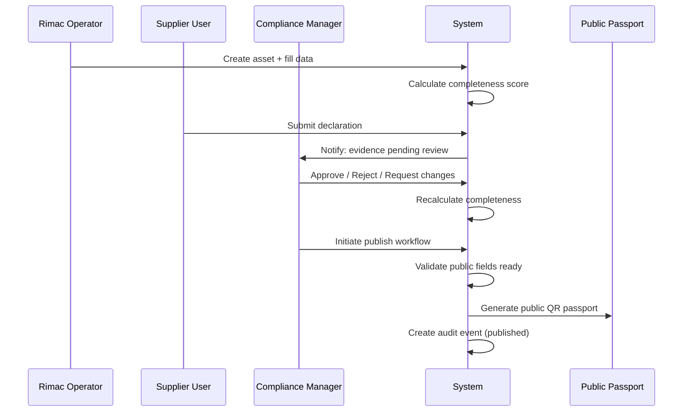

## New Routes

| Route | Page Component | Auth Required | Roles Allowed |
|-------|---------------|:---:|---|
| `/assets/new` | `CreateAssetPage` | Yes | RIMAC_OPERATOR, ADMIN |
| `/import` | `CSVImportPage` | Yes | RIMAC_OPERATOR, ADMIN |
| `/integrations` | `MockIntegrationsPage` | Yes | RIMAC_OPERATOR, ENT_PLATFORM_OPERATOR, ADMIN |
| `/supplier` | `SupplierPortalPage` | Yes | SUPPLIER_USER |
| `/assets/:assetId/passport/publish` | `PassportPublishPage` | Yes | RIMAC_COMPLIANCE_MANAGER, ADMIN |

## New User Roles

### Extended Role Type

```typescript
// Extension to existing UserRole type
type UserRole =
  | 'PUBLIC_VIEWER'
  | 'ASSET_OWNER'
  | 'RIMAC_SERVICE_ENGINEER'
  | 'ENT_PLATFORM_OPERATOR'
  | 'REGULATOR'
  | 'RECYCLER'
  | 'ADMIN'
  // New data-entry roles
  | 'RIMAC_OPERATOR'
  | 'RIMAC_COMPLIANCE_MANAGER'
  | 'RIMAC_SERVICE_USER'
  | 'SUPPLIER_USER';
```


### New Demo Users

```typescript
const newDemoUsers: DemoUser[] = [
  {
    id: 'USR-OPERATOR-02',
    name: 'Tomislav Jurić',
    email: 'tomislav.juric@rimac-energy.demo',
    role: 'RIMAC_OPERATOR',
    organizationId: 'ORG-RIMAC-DEMO',
  },
  {
    id: 'USR-COMPLIANCE-01',
    name: 'Ana Babić',
    email: 'ana.babic@rimac-energy.demo',
    role: 'RIMAC_COMPLIANCE_MANAGER',
    organizationId: 'ORG-RIMAC-DEMO',
  },
  {
    id: 'USR-SERVICE-02',
    name: 'Marko Novak',
    email: 'marko.novak@rimac-energy.demo',
    role: 'RIMAC_SERVICE_USER',
    organizationId: 'ORG-RIMAC-DEMO',
  },
  {
    id: 'USR-SUPPLIER-01',
    name: 'Chen Wei',
    email: 'chen.wei@demo-cell-supplier.demo',
    role: 'SUPPLIER_USER',
    organizationId: 'ORG-SUPPLIER-A',
  },
];
```

### New Role Permissions

```typescript
const NEW_ROLE_PERMISSIONS: Partial<Record<UserRole, Permission[]>> = {
  RIMAC_OPERATOR: [
    'view_public_passport',
    'view_private_passport',
    'view_telemetry',
    'view_compliance',
    'view_documents',
    'create_assets',
    'edit_assets',
    'import_csv',
    'import_mock_api',
    'create_lifecycle_events',
    'upload_documents',
    'create_tasks',
    'export_reports',
  ],
  RIMAC_COMPLIANCE_MANAGER: [
    'view_public_passport',
    'view_private_passport',
    'view_telemetry',
    'view_compliance',
    'view_documents',
    'view_audit_trail',
    'review_compliance',
    'approve_evidence',
    'reject_evidence',
    'request_changes',
    'publish_passport',
    'upload_documents',
    'create_tasks',
    'export_reports',
  ],
  RIMAC_SERVICE_USER: [
    'view_public_passport',
    'view_private_passport',
    'view_telemetry',
    'view_telemetry_detailed',
    'view_documents',
    'create_lifecycle_events',
    'upload_documents',
    'create_tasks',
  ],
  SUPPLIER_USER: [
    'view_public_passport',
    'view_supplier_obligations',
    'submit_declarations',
    'upload_documents',
    'view_own_submissions',
  ],
};
```


### Extended Permission Matrix

| Feature | RIMAC_OPERATOR | RIMAC_COMPLIANCE_MANAGER | RIMAC_SERVICE_USER | SUPPLIER_USER |
|---------|:---:|:---:|:---:|:---:|
| Create asset | ✓ | ✗ | ✗ | ✗ |
| Edit asset | ✓ | ✗ | ✗ | ✗ |
| CSV import | ✓ | ✗ | ✗ | ✗ |
| Mock API import | ✓ | ✗ | ✗ | ✗ |
| Telemetry controls | ✓ | ✗ | ✗ | ✗ |
| Review evidence | ✗ | ✓ | ✗ | ✗ |
| Approve/reject | ✗ | ✓ | ✗ | ✗ |
| Publish passport | ✗ | ✓ | ✗ | ✗ |
| Submit declarations | ✗ | ✗ | ✗ | ✓ |
| Upload documents | ✓ | ✓ | ✓ | ✓ |
| Lifecycle events | ✓ | ✗ | ✓ | ✗ |
| Supplier portal | ✗ | ✗ | ✗ | ✓ |
| Compliance page | ✓ | ✓ | ✗ | ✗ |
| Audit trail | ✗ | ✓ | ✗ | ✗ |

---

## New Components Design

### Component 1: CreateAssetForm (FR-DI-001, FR-DI-002)

**Purpose**: Multi-section form for manually creating a new battery asset with validation, draft saving, and automatic passport/audit generation.

**Interface**:
```typescript
interface CreateAssetFormProps {
  onSave: (asset: NewAssetDraft) => void;
  onCancel: () => void;
  initialDraft?: Partial<NewAssetDraft>;
  className?: string;
}

interface NewAssetDraft {
  assetId: string;
  serialNumber: string;
  productFamily: string;
  batteryType: string;
  capacityKWh: number;
  chemistryCategory: BatteryChemistry;
  manufacturingDate: string;
  manufacturingSite: string;
  customerProject?: string;
  installationLocation?: string;
  lifecycleStatus: AssetStatus;
  passportStatus: 'draft';
  isDraft: boolean;
}

interface AssetFormField {
  key: keyof NewAssetDraft;
  label: string;
  type: 'text' | 'number' | 'date' | 'select';
  required: boolean;
  visibility: VisibilityLevel;
  placeholder: string;
  options?: string[];
  validation?: (value: unknown) => string | null;
}
```


**Responsibilities**:
- Render form fields grouped by section (Identity, Technical, Location, Status)
- Show visibility badge (Public/Restricted/Confidential) next to each field
- Validate required fields on submit
- Allow "Save as Draft" with partial data
- On successful save: create Asset, create Passport draft, create audit event, calculate initial completeness score
- Display form errors inline
- Show success toast with link to new asset

**Behavior on Save**:
```typescript
function handleAssetSave(draft: NewAssetDraft): void {
  // 1. Create asset in store
  const asset = createAssetFromDraft(draft);
  store.addAsset(asset);

  // 2. Generate passport draft
  const passport = generateInitialPassport(asset);
  store.addPassportDraft(passport);

  // 3. Create audit event
  store.addAuditEvent({
    action: 'ASSET_CREATED',
    entityType: 'ASSET',
    entityId: asset.assetId,
    actor: currentUser.name,
    actorRole: currentUser.role,
    reason: draft.isDraft ? 'Asset saved as draft' : 'Asset created manually',
    source: 'manual',
  });

  // 4. Calculate initial completeness
  const score = calculateCompletenessScore(asset, passport);
  store.updateCompleteness(asset.assetId, score);
}
```

---

### Component 2: CSVImportWizard (FR-DI-003, FR-DI-004)

**Purpose**: Multi-step wizard simulating CSV/Excel import of battery assets with template download, paste/upload, validation preview, and confirmation.

**Interface**:
```typescript
interface CSVImportWizardProps {
  onComplete: (importResult: ImportResult) => void;
  onCancel: () => void;
  className?: string;
}

type ImportStep = 'template' | 'upload' | 'validate' | 'preview' | 'confirm' | 'complete';

interface ImportResult {
  totalRows: number;
  successCount: number;
  warningCount: number;
  errorCount: number;
  duplicateCount: number;
  importedAssets: Asset[];
  auditEventId: string;
}

interface CSVRow {
  rowNumber: number;
  data: Record<string, string>;
  status: 'valid' | 'warning' | 'error' | 'duplicate';
  errors: string[];
  warnings: string[];
}
```


**Responsibilities**:
- Step 1 (Template): Show downloadable CSV template with example rows; provide copy-to-clipboard
- Step 2 (Upload): Textarea for pasting CSV data or simulated file upload button
- Step 3 (Validate): Parse CSV, check required fields, detect duplicates, show row-by-row status
- Step 4 (Preview): Show data table with valid/warning/error indicators; allow deselecting rows
- Step 5 (Confirm): Summary of what will be imported; user clicks "Import"
- Step 6 (Complete): Success message with count of imported assets and link to registry

**Validation Rules**:
```typescript
interface CSVValidationRules {
  requiredColumns: string[];    // asset_id, serial_number, product_family, battery_type, capacity_kwh, chemistry
  optionalColumns: string[];    // manufacturing_date, manufacturing_site, location, lifecycle_status
  duplicateCheck: 'asset_id';   // Check against existing assets in store
  capacityRange: [1, 10000];    // kWh validation
  chemistryAllowed: ['LFP', 'NMC', 'NCA', 'LTO'];
  dateFormat: 'YYYY-MM-DD';
}

function validateCSVRow(row: Record<string, string>, existingAssetIds: string[]): CSVRow {
  const errors: string[] = [];
  const warnings: string[] = [];

  // Required field checks
  for (const col of REQUIRED_COLUMNS) {
    if (!row[col]?.trim()) errors.push(`Missing required field: ${col}`);
  }

  // Duplicate check
  if (existingAssetIds.includes(row.asset_id)) {
    return { ...row, status: 'duplicate', errors: ['Duplicate asset_id'] };
  }

  // Capacity range
  const cap = parseFloat(row.capacity_kwh);
  if (isNaN(cap) || cap < 1 || cap > 10000) {
    errors.push('capacity_kwh must be between 1 and 10000');
  }

  // Chemistry validation
  if (row.chemistry && !ALLOWED_CHEMISTRIES.includes(row.chemistry)) {
    warnings.push(`Unknown chemistry: ${row.chemistry}`);
  }

  const status = errors.length > 0 ? 'error' : warnings.length > 0 ? 'warning' : 'valid';
  return { rowNumber: 0, data: row, status, errors, warnings };
}
```

**Demo CSV Data** (pre-loaded for demo):
```csv
asset_id,serial_number,product_family,battery_type,capacity_kwh,chemistry,manufacturing_date,manufacturing_site,location,lifecycle_status
SINE-HR-ZG-001,RE-SN-2026-000145,Rimac Energy SineStack,Industrial BESS,868,LFP,2026-04-18,Rimac Campus Croatia,Zagreb Croatia,Commissioned
SINE-DE-MUN-002,RE-SN-2026-000188,Rimac Energy SineStack,Industrial BESS,1736,LFP,2026-05-02,Rimac Campus Croatia,Munich Germany,Installed
EVP-DEMO-RT-011,RT-HV-2026-000011,Rimac Technology HV Pack,EV Battery,102,NMC,2026-04-22,Rimac Campus Croatia,OEM Demo Program,Prototype
```

---

### Component 3: MockIntegrationPanel (FR-DI-005)

**Purpose**: Dashboard showing mock enterprise system integrations (PLM, MES, ERP, QMS, BMS) with "Import" buttons that simulate data flowing from each system.

**Interface**:
```typescript
interface MockIntegrationPanelProps {
  assetId?: string;  // If provided, import for specific asset
  className?: string;
}

interface MockIntegration {
  id: string;
  system: IntegrationSystem;
  label: string;
  description: string;
  icon: LucideIcon;
  status: 'idle' | 'syncing' | 'success' | 'error';
  lastSync?: string;
  fieldsPopulated: string[];
  dataPreview: Record<string, string | number>;
}

type IntegrationSystem = 'PLM' | 'MES' | 'ERP' | 'QMS' | 'BMS' | 'DOCUMENT_VAULT';
```


**Responsibilities**:
- Display card per integration system with name, description, status badge, last sync time
- Each card has "Import" button that triggers simulated import
- On import: show loading spinner (1-2s), populate relevant passport fields, update completeness, create audit event
- Show which fields each system populates
- Display "data preview" showing what was imported
- Track import source on each field: `source: 'PLM' | 'MES' | 'ERP' | 'QMS' | 'BMS'`

**Mock Data per System**:
```typescript
const MOCK_INTEGRATION_DATA: Record<IntegrationSystem, Record<string, unknown>> = {
  PLM: {
    fieldsPopulated: ['product_model', 'chemistry', 'configuration', 'technical_specs'],
    data: {
      productModel: 'SineStack SE-868-2H',
      chemistryType: 'LFP (LiFePO4)',
      nominalVoltage: '1024V DC',
      modules: 16,
      cellsPerModule: 32,
    },
  },
  MES: {
    fieldsPopulated: ['serial_number', 'manufacturing_date', 'production_batch', 'factory_test'],
    data: {
      serialNumber: 'RE-SN-2026-000145',
      productionBatch: 'BATCH-2026-Q2-014',
      manufacturingDate: '2026-04-18',
      factoryTestResult: 'PASS',
      factoryTestDate: '2026-04-20',
    },
  },
  ERP: {
    fieldsPopulated: ['supplier_refs', 'purchase_orders', 'component_categories'],
    data: {
      primarySupplier: 'Demo Cell Supplier A',
      purchaseOrder: 'PO-2026-RE-0042',
      componentCategories: ['cells', 'BMS', 'enclosure', 'power_electronics'],
    },
  },
  QMS: {
    fieldsPopulated: ['quality_gate', 'inspection_report', 'test_certificates'],
    data: {
      qualityGate: 'QG-4 Passed',
      inspectionDate: '2026-04-19',
      certificateIds: ['CERT-IEC-62619', 'CERT-UN38.3'],
    },
  },
  BMS: {
    fieldsPopulated: ['soc', 'soh', 'cycle_count', 'lifetime_estimate', 'degradation_trend'],
    data: {
      currentSoC: 72.4,
      currentSoH: 98.7,
      cycleCount: 842,
      expectedLifetimeYears: 11.4,
      degradationRatePerYear: 0.3,
    },
  },
  DOCUMENT_VAULT: {
    fieldsPopulated: ['certificates', 'declarations', 'manuals', 'audit_reports'],
    data: {
      linkedDocuments: 4,
      types: ['EU_DECLARATION_OF_CONFORMITY', 'SAFETY_INSTRUCTIONS', 'CARBON_FOOTPRINT_STATEMENT'],
    },
  },
};
```

---

### Component 4: TelemetrySimulatorControls (FR-DI-006)

**Purpose**: Enhanced telemetry simulator panel replacing/extending the existing DemoDataControlPanel with start/stop/scenario controls.

**Interface**:
```typescript
interface TelemetrySimulatorControlsProps {
  assetId: string;
  className?: string;
}

interface SimulatorState {
  isRunning: boolean;
  scenario: TelemetryScenario;
  intervalMs: number;
  tickCount: number;
  lastTick?: string;
}

type TelemetryScenario = 'normal' | 'warning' | 'critical' | 'degradation';

interface ScenarioConfig {
  id: TelemetryScenario;
  label: string;
  description: string;
  icon: LucideIcon;
  color: string;
  parameters: {
    socRange: [number, number];
    sohDecayRate: number;
    tempRange: [number, number];
    alarmProbability: number;
    connectivityLossProbability: number;
  };
}
```


**Responsibilities**:
- Start/Stop button for telemetry generation (uses `setInterval` at configurable rate)
- Scenario selector: Normal, Warning, Critical, Degradation
- Display live tick counter and last tick timestamp
- On each tick: generate one TelemetryReading, push to store, update asset's latestTelemetry
- Scenario controls change generation parameters in real time
- "Reset to Healthy" button clears alarms and resets to normal baseline
- Show current simulated values (SoC, SoH, Temp, Alarms) in mini cards
- Mark all generated data with `source: 'Telemetry Simulator'`

**Scenario Definitions**:
```typescript
const SCENARIOS: ScenarioConfig[] = [
  {
    id: 'normal',
    label: 'Normal Operation',
    description: 'Healthy cycling between 20-90% SoC, stable SoH',
    parameters: {
      socRange: [20, 90],
      sohDecayRate: 0.001,
      tempRange: [22, 32],
      alarmProbability: 0,
      connectivityLossProbability: 0,
    },
  },
  {
    id: 'warning',
    label: 'Warning Condition',
    description: 'Elevated temperature, occasional connectivity loss',
    parameters: {
      socRange: [15, 85],
      sohDecayRate: 0.003,
      tempRange: [30, 42],
      alarmProbability: 0.1,
      connectivityLossProbability: 0.05,
    },
  },
  {
    id: 'critical',
    label: 'Critical Alarm',
    description: 'High thermal gradient, multiple active alarms',
    parameters: {
      socRange: [10, 70],
      sohDecayRate: 0.01,
      tempRange: [38, 55],
      alarmProbability: 0.4,
      connectivityLossProbability: 0.15,
    },
  },
  {
    id: 'degradation',
    label: 'Accelerated Degradation',
    description: 'Rapid SoH decline, efficiency drop',
    parameters: {
      socRange: [20, 80],
      sohDecayRate: 0.02,
      tempRange: [25, 36],
      alarmProbability: 0.05,
      connectivityLossProbability: 0,
    },
  },
];
```

---

### Component 5: SupplierPortalView (FR-DI-007)

**Purpose**: Dedicated view for supplier users showing their obligations, pending requests, and submission workflow.

**Interface**:
```typescript
interface SupplierPortalViewProps {
  supplierId: string;
  className?: string;
}

interface SupplierObligation {
  obligationId: string;
  assetId: string;
  component: string;
  requiredEvidence: string;
  status: SupplierSubmissionStatus;
  dueDate: string;
  submittedAt?: string;
  reviewedAt?: string;
  rejectionReason?: string;
}

type SupplierSubmissionStatus =
  | 'pending'
  | 'submitted'
  | 'under_review'
  | 'approved'
  | 'rejected'
  | 'changes_requested';

interface SupplierDeclaration {
  declarationId: string;
  obligationId: string;
  type: 'structured_data' | 'document_upload';
  content?: Record<string, unknown>;
  documentId?: string;
  submittedBy: string;
  submittedAt: string;
}
```


**Responsibilities**:
- Show only obligations relevant to the logged-in supplier (filtered by organizationId)
- Display table of pending requests with due dates and status badges
- Provide "Submit Declaration" action per obligation
- Support structured data entry (key-value form) or document upload
- Show approval status and rejection reasons
- Supplier-submitted data enters "under_review" state — never auto-approved
- Create audit event on every submission

**Demo Suppliers Data**:
```typescript
const DEMO_SUPPLIERS: DemoOrganization[] = [
  { id: 'ORG-SUPPLIER-A', name: 'Demo Cell Supplier A', type: 'supplier', country: 'China' },
  { id: 'ORG-SUPPLIER-B', name: 'Demo Electronics Supplier B', type: 'supplier', country: 'Germany' },
  { id: 'ORG-SUPPLIER-C', name: 'Demo Materials Supplier C', type: 'supplier', country: 'Australia' },
  { id: 'ORG-SUPPLIER-D', name: 'Demo Enclosure Supplier D', type: 'supplier', country: 'Croatia' },
];

const DEMO_OBLIGATIONS: SupplierObligation[] = [
  {
    obligationId: 'OBL-001',
    assetId: 'ASSET-SEST-ZG-0001',
    component: 'Battery cells',
    requiredEvidence: 'Cell chemistry declaration, recycled content declaration',
    status: 'pending',
    dueDate: '2026-07-15',
  },
  {
    obligationId: 'OBL-002',
    assetId: 'ASSET-SEST-ZG-0001',
    component: 'BMS electronics',
    requiredEvidence: 'RoHS/REACH declaration, safety certificate',
    status: 'submitted',
    dueDate: '2026-07-01',
    submittedAt: '2026-06-20T14:30:00Z',
  },
  // ...more obligations
];
```

---

### Component 6: ComplianceReviewPanel (FR-DI-009)

**Purpose**: Panel for Compliance Managers to review, approve, reject, or request changes on submitted compliance evidence.

**Interface**:
```typescript
interface ComplianceReviewPanelProps {
  assetId: string;
  className?: string;
}

interface ReviewableItem {
  itemId: string;
  type: 'supplier_declaration' | 'document' | 'passport_attribute';
  title: string;
  submittedBy: string;
  submittedAt: string;
  source: DataSource;
  status: ReviewStatus;
  content: Record<string, unknown>;
  linkedDocumentId?: string;
  reviewHistory: ReviewAction[];
}

type ReviewStatus = 'pending_review' | 'approved' | 'rejected' | 'changes_requested';

interface ReviewAction {
  action: 'approve' | 'reject' | 'request_changes';
  reviewer: string;
  timestamp: string;
  comment: string;
}
```

**Responsibilities**:
- List all items pending compliance review for a given asset
- Each item shows: title, submitter, submission date, linked evidence
- Reviewer can:
  - **Approve**: moves status to 'approved', updates passport attribute to 'verified'
  - **Reject**: moves status to 'rejected', adds rejection reason
  - **Request Changes**: moves to 'changes_requested', sends back to submitter
- All actions require a comment
- Each action creates an audit trail event
- After approval: recalculate passport completeness score
- Show review history timeline per item

---

### Component 7: PassportPublishWorkflow (FR-DI-011, FR-DI-012)

**Purpose**: Multi-step workflow for previewing and publishing a public QR passport.

**Interface**:
```typescript
interface PassportPublishWorkflowProps {
  assetId: string;
  passportId: string;
  className?: string;
}

type PublishStep = 'readiness_check' | 'preview' | 'confirm' | 'published';

interface PublishReadinessCheck {
  isReady: boolean;
  score: number;
  requiredFieldsComplete: boolean;
  publicFieldsPopulated: boolean;
  blockers: string[];
  warnings: string[];
}

interface PublicPassportData {
  passportId: string;
  model: string;
  manufacturer: string;
  batteryCategory: string;
  capacity: string;
  chemistry: string;
  productionYear: number;
  publicSafetySummary: string;
  recyclingSummary: string;
  complianceBadge: string;
  publishedAt: string;
  publishedBy: string;
}
```


**Responsibilities**:
- Step 1 (Readiness Check): Validate that all required PUBLIC fields are populated and approved
  - Show blockers (missing required public fields) and warnings (optional fields missing)
  - Block publishing if any blockers exist
- Step 2 (Preview): Render a preview of the public QR passport exactly as external viewers would see it
  - Show ONLY fields classified as `visibility: 'public'`
  - Hide all Restricted and Confidential fields
- Step 3 (Confirm): Final confirmation with summary, publisher identity, and timestamp
- Step 4 (Published): Success state showing QR code, public URL, and audit event reference
- On publish: update passport status to 'published', create audit event, generate public passport data
- Only accessible to RIMAC_COMPLIANCE_MANAGER role

---

### Component 8: LifecycleEventForm (FR-DI-013)

**Purpose**: Form for adding lifecycle events (service, operational, compliance) to a battery asset's timeline.

**Interface**:
```typescript
interface LifecycleEventFormProps {
  assetId: string;
  onSave: (event: NewLifecycleEvent) => void;
  onCancel: () => void;
  className?: string;
}

interface NewLifecycleEvent {
  type: LifecycleEventType;
  category: EventCategory;
  description: string;
  actor: string;
  timestamp: string;
  source: 'manual';
  documentId?: string;
  metadata?: Record<string, string>;
}

// Additional lifecycle event types for data entry
type ExtendedLifecycleEventType =
  | LifecycleEventType
  | 'maintenance_performed'
  | 'capacity_test'
  | 'software_update'
  | 'site_relocation'
  | 'ownership_transfer'
  | 'insurance_assessment'
  | 'performance_certification';
```

**Responsibilities**:
- Dropdown for event type (grouped by category: Production, Operational, Service, Compliance)
- Date/time picker for event timestamp
- Free-text description field
- Optional document link dropdown (from document vault)
- Optional key-value metadata fields
- On save: add event to lifecycle timeline, create audit event
- Accessible to RIMAC_OPERATOR and RIMAC_SERVICE_USER roles

---

## New Data Models

### Visibility Classification (FR-DI-015)

```typescript
type VisibilityLevel = 'public' | 'restricted' | 'confidential';

interface VisibilityClassification {
  fieldPath: string;       // e.g., 'asset.capacityKWh'
  visibility: VisibilityLevel;
  reason: string;
  canOverride: boolean;    // whether compliance manager can change
}

// Default visibility rules for asset fields
const FIELD_VISIBILITY_MAP: Record<string, VisibilityLevel> = {
  // Public fields
  'asset.productFamily': 'public',
  'asset.batteryType': 'public',
  'asset.capacityKWh': 'public',
  'asset.chemistryCategory': 'public',
  'asset.lifecycleStatus': 'public',
  'passport.model': 'public',
  'passport.manufacturer': 'public',
  'passport.batteryCategory': 'public',
  'passport.productionYear': 'public',
  'passport.safetySummary': 'public',
  'passport.recyclingSummary': 'public',

  // Restricted fields
  'asset.assetId': 'restricted',
  'asset.manufacturingDate': 'restricted',
  'asset.manufacturingSite': 'restricted',
  'asset.installationLocation': 'restricted',
  'asset.passportStatus': 'restricted',
  'telemetry.soc': 'restricted',
  'telemetry.soh': 'restricted',
  'telemetry.cycleCount': 'restricted',

  // Confidential fields
  'asset.serialNumber': 'confidential',
  'asset.customerProject': 'confidential',
  'supplier.purchaseOrder': 'confidential',
  'supplier.costData': 'confidential',
  'telemetry.moduleLevel': 'confidential',
};
```


### Document Upload Model (FR-DI-008)

```typescript
interface DocumentUpload {
  uploadId: string;
  documentType: DocumentType;
  title: string;
  description: string;
  linkedAssetId: string;
  linkedPassportAttributes: string[];
  visibility: VisibilityLevel;
  status: DocumentUploadStatus;
  uploadedBy: string;
  uploadedAt: string;
  fileSimulation: {
    fileName: string;
    fileSize: string;
    mimeType: string;
  };
  reviewStatus: ReviewStatus;
  reviewComment?: string;
}

type DocumentUploadStatus = 'uploading' | 'uploaded' | 'linked' | 'verified' | 'rejected';

// Extended document types for new workflows
type ExtendedDocumentType =
  | DocumentType
  | 'RECYCLED_CONTENT_DECLARATION'
  | 'SUPPLIER_DUE_DILIGENCE_STATEMENT'
  | 'ORIGIN_DECLARATION'
  | 'ROHS_REACH_DECLARATION'
  | 'MATERIAL_COMPOSITION_DECLARATION'
  | 'BATTERY_CHEMISTRY_DECLARATION'
  | 'QUALITY_GATE_REPORT'
  | 'PERFORMANCE_TEST_REPORT';
```

### Passport Completeness Score Model (FR-DI-010)

```typescript
interface PassportCompletenessScore {
  assetId: string;
  overallScore: number;        // 0-100
  sectionScores: SectionScore[];
  completedFields: number;
  totalRequiredFields: number;
  verifiedFields: number;
  pendingReviewFields: number;
  lastUpdated: string;
  trend: 'improving' | 'stable' | 'declining';
  scoreHistory: ScoreSnapshot[];
}

interface SectionScore {
  section: PassportSection;
  score: number;
  completedCount: number;
  totalCount: number;
  blockers: string[];
}

interface ScoreSnapshot {
  timestamp: string;
  score: number;
  trigger: string;  // What action caused this score change
}
```

### Enhanced Audit Event Model (FR-DI-014)

```typescript
// Extended audit actions for new data entry workflows
type ExtendedAuditAction =
  | AuditAction
  | 'ASSET_DRAFT_SAVED'
  | 'CSV_IMPORT_COMPLETED'
  | 'MOCK_API_IMPORT'
  | 'TELEMETRY_SIMULATOR_STARTED'
  | 'TELEMETRY_SIMULATOR_STOPPED'
  | 'TELEMETRY_SCENARIO_CHANGED'
  | 'SUPPLIER_DECLARATION_SUBMITTED'
  | 'COMPLIANCE_REVIEW_APPROVED'
  | 'COMPLIANCE_REVIEW_REJECTED'
  | 'COMPLIANCE_CHANGES_REQUESTED'
  | 'PASSPORT_PUBLISHED'
  | 'PASSPORT_UNPUBLISHED'
  | 'LIFECYCLE_EVENT_ADDED'
  | 'DOCUMENT_LINKED'
  | 'VISIBILITY_CHANGED'
  | 'COMPLETENESS_RECALCULATED';

interface EnhancedAuditEvent extends AuditEvent {
  dataSource: DataSource;          // Where the action originated
  affectedFields?: string[];       // Which fields were changed
  scoreImpact?: number;            // How much completeness changed
  visibility?: VisibilityLevel;    // Visibility of the affected data
}
```

---

## New Store Slices

### Data Ingestion Slice

```typescript
interface DataIngestionSlice {
  // CSV Import state
  csvImportInProgress: boolean;
  csvImportRows: CSVRow[];
  csvImportResult: ImportResult | null;
  startCSVImport: (rows: CSVRow[]) => void;
  completeCSVImport: (result: ImportResult) => void;
  resetCSVImport: () => void;

  // Mock Integration state
  integrationStatuses: Record<IntegrationSystem, MockIntegration>;
  triggerMockImport: (system: IntegrationSystem, assetId: string) => void;

  // Telemetry Simulator state
  simulatorStates: Record<string, SimulatorState>;  // keyed by assetId
  startSimulator: (assetId: string, scenario: TelemetryScenario) => void;
  stopSimulator: (assetId: string) => void;
  changeScenario: (assetId: string, scenario: TelemetryScenario) => void;
  resetSimulator: (assetId: string) => void;

  // Asset creation
  draftAssets: NewAssetDraft[];
  saveDraft: (draft: NewAssetDraft) => void;
  publishDraft: (assetId: string) => void;
}
```


### Supplier Slice

```typescript
interface SupplierSlice {
  obligations: SupplierObligation[];
  declarations: SupplierDeclaration[];

  // Supplier actions
  submitDeclaration: (declaration: SupplierDeclaration) => void;
  getObligationsForSupplier: (supplierId: string) => SupplierObligation[];

  // Compliance manager actions
  approveDeclaration: (declarationId: string, comment: string) => void;
  rejectDeclaration: (declarationId: string, reason: string) => void;
  requestChanges: (declarationId: string, comment: string) => void;
}
```

### Workflow Slice

```typescript
interface WorkflowSlice {
  // Completeness scoring
  completenessScores: Record<string, PassportCompletenessScore>; // keyed by assetId
  recalculateCompleteness: (assetId: string) => void;

  // Passport publishing
  publishingState: Record<string, PublishStep>;  // keyed by passportId
  startPublishWorkflow: (passportId: string) => void;
  completePublish: (passportId: string) => void;
  cancelPublish: (passportId: string) => void;

  // Review queue
  reviewQueue: ReviewableItem[];
  addToReviewQueue: (item: ReviewableItem) => void;
  processReview: (itemId: string, action: ReviewAction) => void;

  // Lifecycle events (new entries)
  addLifecycleEvent: (event: NewLifecycleEvent) => void;
}
```

---

## Key Functions with Formal Specifications

### Function 5: calculateCompletenessScore() (FR-DI-010)

```typescript
function calculateCompletenessScore(
  asset: Asset,
  passportAttributes: PassportAttribute[],
  documents: Document[],
  supplierDeclarations: SupplierDeclaration[]
): PassportCompletenessScore
```

**Preconditions:**
- `asset` is a valid Asset with assetId
- `passportAttributes` includes all attributes for this asset's passport
- `documents` contains documents linked to this asset
- `supplierDeclarations` contains declarations relevant to this asset

**Postconditions:**
- Returns score in range [0, 100]
- Score accounts for: field population (40%), verification status (30%), document evidence (20%), supplier declarations (10%)
- Each section has its own sub-score
- Score changes deterministically for same inputs
- Returns `trend` based on last 3 score snapshots

**Algorithm:**
```typescript
function calculateCompletenessScore(
  asset: Asset,
  attributes: PassportAttribute[],
  documents: Document[],
  declarations: SupplierDeclaration[]
): PassportCompletenessScore {
  const sections = groupBySection(attributes);
  const sectionScores: SectionScore[] = [];

  for (const [section, attrs] of Object.entries(sections)) {
    const required = attrs.filter(a => a.status !== 'not_applicable');
    const completed = required.filter(a => a.status !== 'missing');
    const verified = required.filter(a => a.status === 'verified');

    const populationScore = (completed.length / required.length) * 40;
    const verificationScore = (verified.length / required.length) * 30;

    const linkedDocs = documents.filter(d => d.assetId === asset.assetId);
    const verifiedDocs = linkedDocs.filter(d => d.status === 'verified');
    const documentScore = linkedDocs.length > 0
      ? (verifiedDocs.length / linkedDocs.length) * 20 : 0;

    const relevantDeclarations = declarations.filter(
      d => d.obligationId.startsWith(asset.assetId)
    );
    const approvedDeclarations = relevantDeclarations.filter(
      d => d.status === 'approved'
    );
    const supplierScore = relevantDeclarations.length > 0
      ? (approvedDeclarations.length / relevantDeclarations.length) * 10 : 0;

    const sectionTotal = populationScore + verificationScore + documentScore + supplierScore;
    sectionScores.push({
      section: section as PassportSection,
      score: Math.round(sectionTotal),
      completedCount: completed.length,
      totalCount: required.length,
      blockers: required
        .filter(a => a.status === 'missing')
        .map(a => a.name),
    });
  }

  const overallScore = Math.round(
    sectionScores.reduce((sum, s) => sum + s.score, 0) / sectionScores.length
  );

  return {
    assetId: asset.assetId,
    overallScore,
    sectionScores,
    completedFields: attributes.filter(a => a.status !== 'missing').length,
    totalRequiredFields: attributes.filter(a => a.status !== 'not_applicable').length,
    verifiedFields: attributes.filter(a => a.status === 'verified').length,
    pendingReviewFields: attributes.filter(a => a.verificationStatus === 'pending_internal').length,
    lastUpdated: new Date().toISOString(),
    trend: determineTrend(/* last 3 snapshots */),
    scoreHistory: [],
  };
}
```


### Function 6: validateCSVImport() (FR-DI-003, FR-DI-004)

```typescript
function validateCSVImport(
  rawCSV: string,
  existingAssetIds: string[]
): CSVValidationResult
```

**Preconditions:**
- `rawCSV` is a non-empty string with CSV content
- `existingAssetIds` is the current list of asset IDs in the store
- CSV has a header row

**Postconditions:**
- Returns parsed rows with validation status per row
- Duplicate asset_ids flagged as 'duplicate'
- Missing required fields flagged as 'error'
- Invalid values flagged with specific error messages
- Valid rows can be imported; error/duplicate rows are excluded
- Total counts are accurate

```typescript
interface CSVValidationResult {
  isValid: boolean;
  totalRows: number;
  validRows: CSVRow[];
  warningRows: CSVRow[];
  errorRows: CSVRow[];
  duplicateRows: CSVRow[];
  headerErrors: string[];
}
```

### Function 7: processComplianceReview() (FR-DI-009)

```typescript
function processComplianceReview(
  itemId: string,
  action: 'approve' | 'reject' | 'request_changes',
  reviewer: string,
  comment: string
): ReviewResult
```

**Preconditions:**
- `itemId` refers to a valid ReviewableItem in the review queue
- `reviewer` has RIMAC_COMPLIANCE_MANAGER role
- `comment` is non-empty string
- Item is currently in 'pending_review' status

**Postconditions:**
- On approve: item status → 'approved', linked passport attribute → 'verified', completeness recalculated
- On reject: item status → 'rejected', rejection reason stored
- On request_changes: item status → 'changes_requested', sent back to submitter
- Audit event created for every action
- Score impact calculated and stored in audit event

```typescript
interface ReviewResult {
  success: boolean;
  newStatus: ReviewStatus;
  scoreImpact: number;           // +/- change to completeness
  auditEventId: string;
  notification?: string;          // Message for submitter
}
```

### Function 8: publishPassport() (FR-DI-011, FR-DI-012)

```typescript
function publishPassport(
  passportId: string,
  publisherId: string
): PublishResult
```

**Preconditions:**
- Passport exists and belongs to a valid asset
- All required PUBLIC fields are populated (no blockers)
- Publisher has RIMAC_COMPLIANCE_MANAGER role
- Passport is not already published

**Postconditions:**
- Public passport data generated with ONLY public-visibility fields
- Passport status updated to 'published'
- Audit event created: 'PASSPORT_PUBLISHED'
- QR code data includes public passport URL
- Confidential and restricted fields are never included in public data

```typescript
interface PublishResult {
  success: boolean;
  publicPassportData?: PublicPassportData;
  publicUrl?: string;
  auditEventId: string;
  errors?: string[];
}
```

---

## Sequence Diagrams for New Workflows

### Create Asset Flow

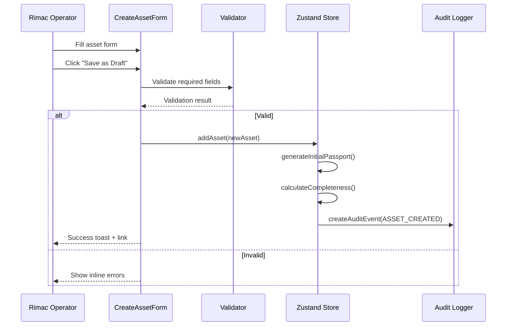

### CSV Import Flow

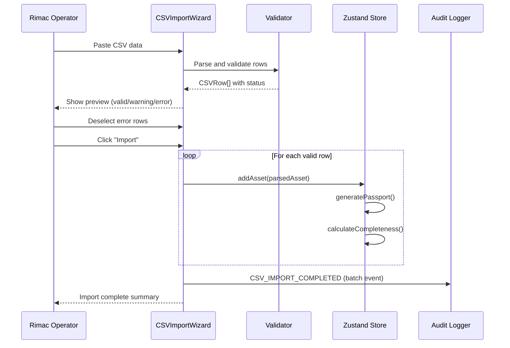


### Supplier Declaration Flow

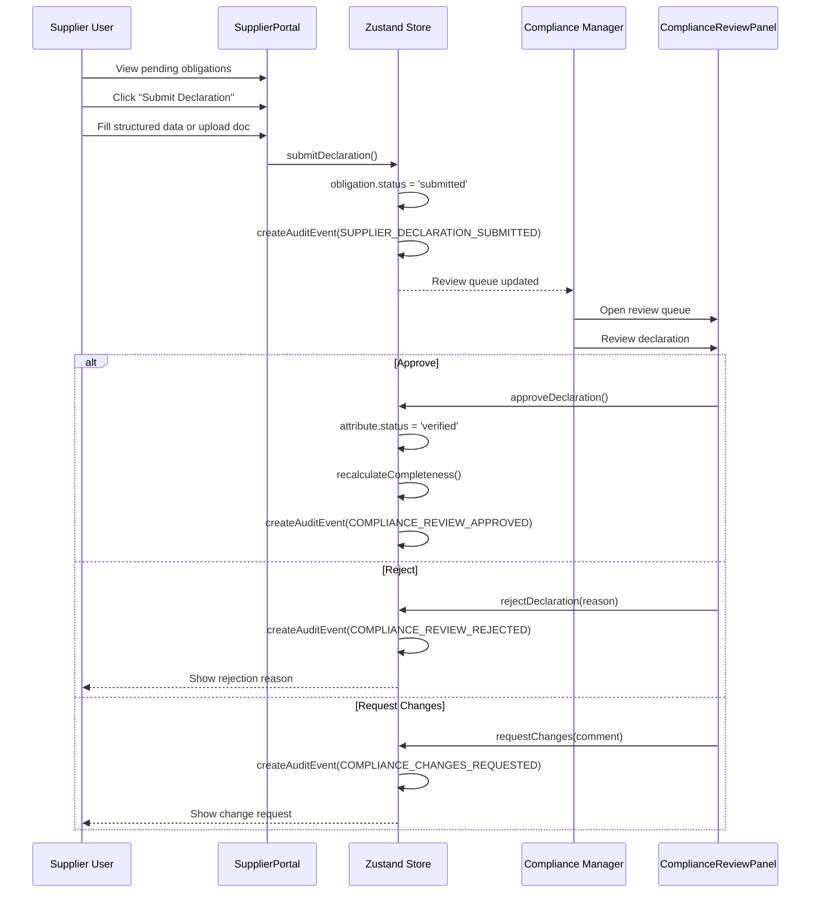

### Passport Publishing Flow

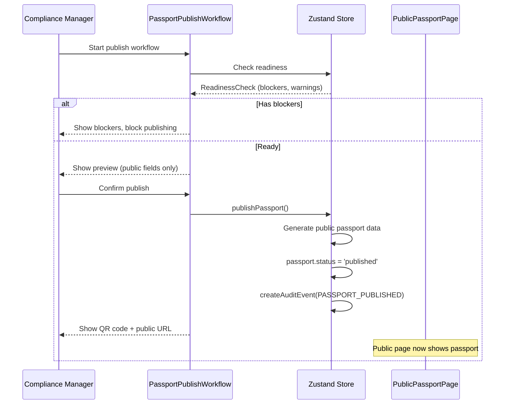

---

## Updated Project Structure (New Files)

```
src/
├── components/
│   └── domain/
│       ├── CreateAssetForm.tsx         # FR-DI-001, FR-DI-002
│       ├── CSVImportWizard.tsx         # FR-DI-003, FR-DI-004
│       ├── MockIntegrationPanel.tsx    # FR-DI-005
│       ├── TelemetrySimulatorControls.tsx  # FR-DI-006 (enhanced)
│       ├── SupplierPortalView.tsx      # FR-DI-007
│       ├── DocumentUploadForm.tsx      # FR-DI-008
│       ├── ComplianceReviewPanel.tsx   # FR-DI-009
│       ├── PassportCompletenessCard.tsx # FR-DI-010
│       ├── PassportPublishWorkflow.tsx # FR-DI-011, FR-DI-012
│       ├── LifecycleEventForm.tsx      # FR-DI-013
│       └── VisibilityBadge.tsx         # FR-DI-015
├── pages/
│   ├── CreateAssetPage.tsx
│   ├── CSVImportPage.tsx
│   ├── MockIntegrationsPage.tsx
│   ├── SupplierPortalPage.tsx
│   └── PassportPublishPage.tsx
├── store/
│   └── slices/
│       ├── dataIngestion.ts           # New slice
│       ├── supplier.ts                # New slice
│       └── workflow.ts                # New slice
├── data/
│   ├── suppliers.ts                   # Demo supplier data
│   ├── obligations.ts                 # Demo supplier obligations
│   └── csvTemplates.ts               # Pre-loaded CSV demo data
├── lib/
│   ├── completenessScore.ts           # Enhanced scoring algorithm
│   ├── csvValidator.ts                # CSV parsing and validation
│   ├── visibilityClassifier.ts        # Field visibility logic
│   └── auditLogger.ts                # Centralized audit event creation
└── types/
    ├── dataIngestion.ts               # New types for ingestion workflows
    ├── supplier.ts                    # Supplier/obligation types
    └── workflow.ts                    # Review/publishing workflow types
```

---

## Correctness Properties (Data Ingestion Extension)

### Property 11: Audit Trail Completeness

For every user action (create, edit, import, approve, reject, publish), exactly one audit event is created. The audit event contains: action type, actor, timestamp, entity reference, and data source.

### Property 12: Supplier Data Never Auto-Approved

For all supplier-submitted declarations D: `D.status` transitions from 'submitted' to 'under_review' and never directly to 'approved'. Approval requires explicit RIMAC_COMPLIANCE_MANAGER action.

### Property 13: Public Passport Data Safety

For all published public passport data P: every field in P has `visibility === 'public'`. No field with visibility 'restricted' or 'confidential' ever appears in public passport data.


### Property 14: Completeness Score Monotonic on Approval

When a compliance item is approved (status → 'verified'), the passport completeness score must increase or remain the same. It must never decrease due to an approval action.

### Property 15: CSV Import Idempotency Guard

Importing the same CSV data twice never creates duplicate assets. The second import attempt detects existing asset_ids and flags them as duplicates.

### Property 16: Visibility Classification Consistency

Every asset field displayed in the UI has a defined visibility classification. Fields without explicit classification default to 'restricted'.

### Property 17: Role-Scoped Supplier View

Supplier users can only see obligations linked to their own organizationId. They never see obligations or data belonging to other suppliers.

### Property 18: Review Action Requires Comment

All compliance review actions (approve, reject, request_changes) must include a non-empty comment string. The system rejects review actions with empty comments.

### Property 19: Publishing Blocked by Incomplete Public Fields

A passport cannot transition to 'published' status if any required public field has status 'missing'. The publish workflow blocks at the readiness check step.

### Property 20: Telemetry Simulator Isolation

Simulated telemetry data is always marked with `source: 'Telemetry Simulator'` or `source: 'simulated'`. It is never presented as real BMS data.

---

## Error Handling (Data Ingestion Extension)

### Error Scenario 5: CSV Parse Failure

**Condition**: Pasted/uploaded CSV content is malformed (no headers, wrong delimiter, encoding issues).
**Response**: Show "Unable to parse CSV data" error with specific details. Suggest checking format against the template.
**Recovery**: User corrects data and re-pastes. Previous state is preserved.

### Error Scenario 6: Duplicate Asset ID on Create

**Condition**: User enters an asset_id that already exists in the store.
**Response**: Inline validation error on the Asset ID field: "This Asset ID already exists."
**Recovery**: User changes asset_id. Form state preserved.

### Error Scenario 7: Publish Without Required Fields

**Condition**: Compliance Manager attempts to publish a passport that has missing required public fields.
**Response**: Readiness check shows blocking errors with list of missing fields. Publish button disabled.
**Recovery**: User must complete required public fields before retrying.

### Error Scenario 8: Supplier Submits to Closed Obligation

**Condition**: Supplier tries to submit a declaration for an obligation that's already approved.
**Response**: Show "This obligation has already been fulfilled" message. Submission blocked.
**Recovery**: Supplier views current status. No action needed.

### Error Scenario 9: Concurrent Review Actions

**Condition**: Multiple compliance managers try to review the same item.
**Response**: In demo mode, last action wins (no real concurrency). UI shows latest state on re-render.
**Recovery**: The other reviewer sees updated status on next page load.

---

## Testing Strategy (Data Ingestion Extension)

### Additional Unit Tests

- `calculateCompletenessScore` — verify score changes based on field population, verification, documents, declarations
- `validateCSVImport` — verify detection of duplicates, missing required fields, invalid values
- `processComplianceReview` — verify state transitions for approve/reject/request_changes
- `publishPassport` — verify readiness check blocks incomplete passports
- `classifyVisibility` — verify field classification matches defined rules

### Additional Property-Based Tests

1. **Completeness score always in [0, 100]** for any combination of attributes and declarations
2. **CSV validation catches all duplicates** — if asset_id exists, row is always flagged
3. **Public passport data never contains restricted fields** — for any passport state
4. **Supplier obligations filtered by org** — supplier user never sees other org data
5. **Audit events count matches action count** — every store mutation creates exactly one audit event

### Integration Tests

- Create asset form → verify asset appears in registry
- CSV import wizard → verify all valid rows appear as assets
- Mock API import → verify fields populated and score changes
- Supplier submit → compliance review → verify state transitions
- Full publish workflow → verify public passport renders correctly
- Telemetry simulator start/stop → verify readings in store

---

## Performance Considerations (Data Ingestion Extension)

- **CSV Import**: Parsing is synchronous in-browser. For demo purposes, limit to 50 rows maximum. Show progress indicator during validation.
- **Telemetry Simulator**: Uses `setInterval` with configurable tick rate (default 3s). Stores max 500 readings per asset in memory. Older readings pruned on FIFO basis.
- **Completeness Recalculation**: Triggered on specific actions (import, review, approval) rather than on every render. Cached in store.
- **Supplier Portal**: Filtered client-side from full obligations array. No pagination needed for demo (< 20 obligations).
- **Audit Trail Growth**: New actions add to existing audit events array. Virtualized rendering for audit trail table if > 100 events.

---

## Security Considerations (Data Ingestion Extension)

Since this remains a demo with no real backend:
- No real file upload processing — UI simulates file selection but does not read actual files
- Supplier portal isolation is enforced client-side via role filtering
- Publishing workflow is a state transition in Zustand — no server validation
- All "imported" data is synthetic and generated from predefined mock templates
- Visibility classification is advisory for the demo — enforced at UI rendering level
- Review actions use local state only — no authentication tokens
- Demo disclaimer visible on all data entry screens: "All data entered is synthetic demo data"


---

## Example Usage (Data Ingestion)

### Using CreateAssetForm

```typescript
// src/pages/CreateAssetPage.tsx
import { useNavigate } from 'react-router-dom';
import { CreateAssetForm } from '@/components/domain/CreateAssetForm';
import { useAppStore } from '@/store';

export function CreateAssetPage() {
  const navigate = useNavigate();
  const addAsset = useAppStore((s) => s.addAsset);

  return (
    <div className="max-w-3xl mx-auto p-6">
      <h1 className="text-heading-1 text-text-primary mb-6">Create Battery Asset</h1>
      <CreateAssetForm
        onSave={(draft) => {
          addAsset(draft);
          navigate(`/assets/${draft.assetId}`);
        }}
        onCancel={() => navigate('/assets')}
      />
    </div>
  );
}
```

### Using TelemetrySimulatorControls

```typescript
// Usage within TelemetryPage or DemoDataAdmin
import { TelemetrySimulatorControls } from '@/components/domain/TelemetrySimulatorControls';

<TelemetrySimulatorControls assetId={selectedAssetId} />

// Store integration
const startSimulator = useAppStore((s) => s.startSimulator);
const stopSimulator = useAppStore((s) => s.stopSimulator);
const changeScenario = useAppStore((s) => s.changeScenario);

// Start telemetry generation
startSimulator('ASSET-SEST-ZG-0001', 'normal');

// Change to warning scenario while running
changeScenario('ASSET-SEST-ZG-0001', 'warning');

// Stop generation
stopSimulator('ASSET-SEST-ZG-0001');
```

### Using ComplianceReviewPanel

```typescript
// src/pages/CompliancePage.tsx (extended for compliance manager)
import { ComplianceReviewPanel } from '@/components/domain/ComplianceReviewPanel';
import { useRole } from '@/hooks/useRole';

export function CompliancePage() {
  const { currentRole } = useRole();
  const { selectedAsset } = useAssets();

  return (
    <div className="space-y-8">
      {/* Existing compliance gap table */}
      <ComplianceGapTable attributes={attributes} />

      {/* New: Review panel for compliance managers */}
      {currentRole === 'RIMAC_COMPLIANCE_MANAGER' && selectedAsset && (
        <ComplianceReviewPanel assetId={selectedAsset.assetId} />
      )}
    </div>
  );
}
```

### Using PassportPublishWorkflow

```typescript
// src/pages/PassportPublishPage.tsx
import { useParams } from 'react-router-dom';
import { PassportPublishWorkflow } from '@/components/domain/PassportPublishWorkflow';

export function PassportPublishPage() {
  const { assetId } = useParams<{ assetId: string }>();
  const asset = useAppStore((s) => s.assets.find(a => a.assetId === assetId));

  if (!asset) return <NotFoundState />;

  return (
    <div className="max-w-4xl mx-auto p-6">
      <h1 className="text-heading-1 text-text-primary mb-2">Publish Battery Passport</h1>
      <p className="text-sm text-text-secondary mb-8">
        Review and publish the public QR passport for {asset.model}
      </p>
      <PassportPublishWorkflow
        assetId={asset.assetId}
        passportId={asset.passportId}
      />
    </div>
  );
}
```

### Centralized Audit Logger Usage

```typescript
// src/lib/auditLogger.ts
import { useAppStore } from '@/store';
import { v4 as uuid } from 'uuid';

export function createAuditEvent(params: {
  action: ExtendedAuditAction;
  entityType: EntityType;
  entityId: string;
  reason: string;
  dataSource?: DataSource;
  affectedFields?: string[];
  scoreImpact?: number;
}): EnhancedAuditEvent {
  const store = useAppStore.getState();
  const { currentUser } = store;

  const event: EnhancedAuditEvent = {
    auditEventId: `AE-${uuid().slice(0, 8).toUpperCase()}`,
    timestamp: new Date().toISOString(),
    actor: currentUser.name,
    actorRole: currentUser.role,
    action: params.action,
    entityType: params.entityType,
    entityId: params.entityId,
    reason: params.reason,
    traceId: `TR-${uuid().slice(0, 12)}`,
    dataSource: params.dataSource ?? 'manual',
    affectedFields: params.affectedFields,
    scoreImpact: params.scoreImpact,
  };

  store.addAuditEvent(event);
  return event;
}
```

---

## Dependencies (Data Ingestion Extension)

No new external dependencies required. All new functionality uses the existing tech stack:

| Existing Package | New Usage |
|---------|---------|
| zustand | 3 new store slices (dataIngestion, supplier, workflow) |
| react-router-dom | 5 new routes |
| lucide-react | Additional icons (Upload, FileSpreadsheet, Factory, Truck, CheckCircle, XCircle) |
| recharts | Completeness score trend mini-chart |
| tailwindcss | Form styling, step indicators, review action buttons |

**Optional Addition** (for CSV parsing):
| Package | Purpose | Note |
|---------|---------|------|
| papaparse | CSV parsing in browser | Optional — can use simple split-based parser for demo |

Since this is a demo and CSV parsing complexity is minimal (< 50 rows, known schema), a simple built-in parser using `String.split()` is sufficient. No external CSV library is strictly required.
